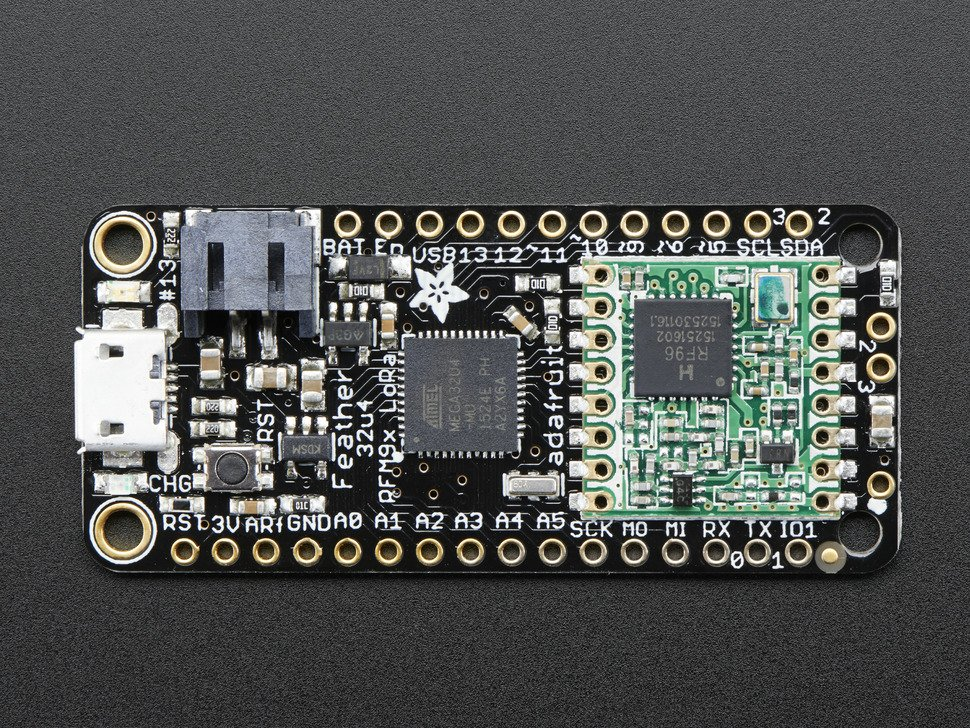
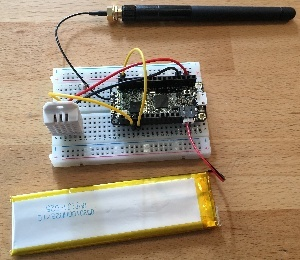
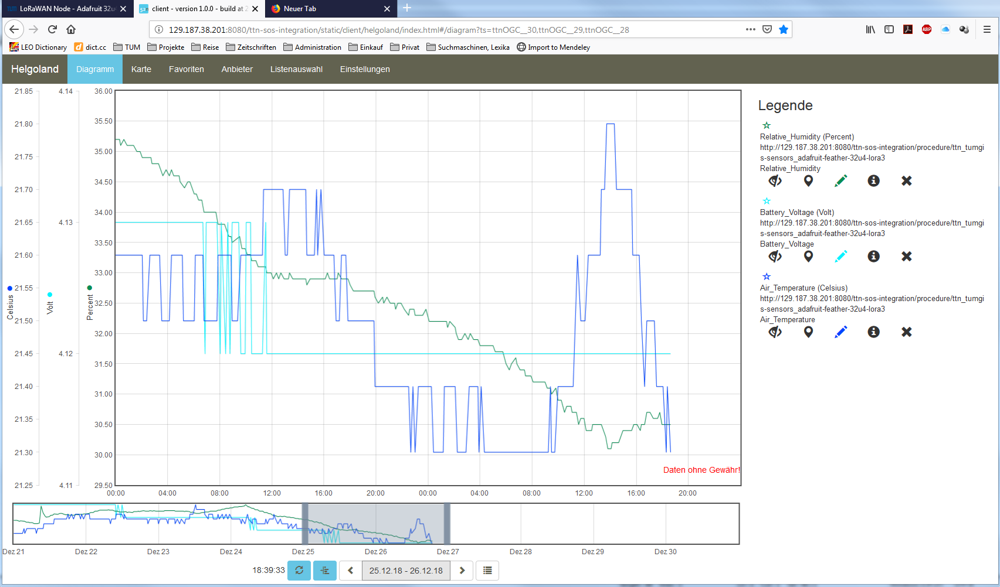

# LoRaWAN Node - Adafruit 32u4 LoRa

This tutorial is made to showcase the use of Adafruit 32u4 board to create a LoRaWAN enabled sensor node. In the following example, a temperature and humidity sensor was used with the Adafruit 32u4 board. 

## Hardware

To build this sensor node we have used following hardware components:

- [Adafruit Feather 32u4 LoRa module](https://www.adafruit.com/product/3078)
- [Grove - DHT-22 Temperature & Humidity Sensor](http://wiki.seeedstudio.com/Grove-Temperature_and_Humidity_Sensor_Pro/) 
- [Breadboard](https://en.wikipedia.org/wiki/Breadboard#/media/File:400_points_breadboard.jpg)
- [Battery](https://www.adafruit.com/product/353)
- [Resistor: 4.7k to 10k Ohm](https://learn.sparkfun.com/tutorials/resistors/all)

### Micro-controller

The Adafruit Feather 32u4 LoRa module is operated by the 8bit ATmega32u4 microcontroller running at 8MHz. It has 32 KB flash memory (to store the program code) and 2 KB of RAM (to store variables, status information, and buffers). The operating voltage of the board is 3.3V (this is important when attaching sensors and other peripherals; they also must operate on 3.3V). The board offers 20 general purpose digital input/output pins (20 GPIOs) with 10 analog input pins (with 12bit analog digital converters (ADC)), one serial port (programmable Universal Asynchronous Receiver and Transmitter, UART), one I2C port, one SPI port, one USB port. The board comes with an embedded Lithium polymer battery management chip and status indicator led, which allows to directly connect a 3.7V LiPo rechargeable battery that will be automatically recharged when the board is powered over its USB connector. The Adafruit Feather 32u4 LoRa board is available in German shops from around 37 € to 45 €.

The LoRa transmitter and receiver is encapsulated within an RFM95 module from the company HopeRF. This module uses the LoRa chip SX1276 from the company Semtech and is dedicated to the 868 MHz frequency band. The RFM95 module is connected via SPI interface to the microcontroller. Most of the required connections of the LoRa transceiver pins with the microcontroller are already built-in on the Adafruit Feather 32u4 LoRa board. However, Digital Pin 6 of the microcontroller must be connected to DIO1 of the LoRa transceiver module in addition using a simple wire. Since the module only implements the LoRa physical layer, the LoRaWAN protocol stack must be implemented in software on the microcontroller. We are using the Arduino library LMIC for that purpose (see below). The implemented LoRaWAN functionality is compatible with LoRaWAN Class A/C.

|  | 
|:--:| 
| *[Feather 32u4 with RFM95 LoRa Radio-868 MHz-RadioFruit](https://www.adafruit.com/product/3078) from Adafruit. [Feather 32u4 LoRa tutorial with explanations, datasheets, and examples](https://learn.adafruit.com/adafruit-feather-32u4-radio-with-lora-radio-module/)* |

### Sensor

We have attached a DHT22 sensor to the microcontroller board, which measures air temperature and humidity. The minimal time interval between two measurements is 2 seconds. All data transfers between the DHT22 and the microcontroller use a single digital line. The sensor data pin is attached to a GPIO pin (here: Digital Pin 5) of the microcontroller. In addition, a so-called pull-up resistor of 4.7k to 10k Ohm must be connected between the data line and VCC (+3.3V). The [DHT22 datasheet](https://www.sparkfun.com/datasheets/Sensors/Temperature/DHT22.pdf) provides more technical details about the DHT22 Sensor. A tutorial on how to use the [DHT22 sensor with Arduino microcontrollers](https://learn.adafruit.com/dht?view=all) is provided here. The sensor is available in German shops for around 4 € to 10 €.

|  | 
|:--:| 
| *The Adafruit Feather 32u4 RFM95 LoRa with attached antenna (top), a 1000 mAh lithium polymer (LiPo) battery (bottom), and an attached DHT22 temperature / humidity sensor (white box on the left)* |

For more details on the wiring connections, follow [this tutorial](https://github.com/tum-gis/sensor-nodes/tree/master/FeatherM0LoRa%20in%20TFA%20Housing#dht-22-sensor-connections). Once all these connection are made, the board is connected with a computer using a USB cable. Further, steps of [software part](#Software) needs to be followed. But, before that we need to [register a new device on the service](#Registration-of-the-sensor-node-with-The-Things-Network-(TTN)) that we are using.

## Software

The sensor node has been programmed using the [Arduino IDE](https://www.arduino.cc/en/main/software). Please note, that in the Arduino framework a program is called a 'Sketch'. 

After the sketch has successfully established a connection to The Things Network it reports the air temperature, humidity, and the voltage of a (possibly) attached LiPo battery every 5 minutes. All three values are being encoded in two byte integer values each (in most significant byte order) and then sent as a 6 bytes data packet to the respective TTN application using LoRaWAN port 7. Please note, that LoRaWAN messages can be addressed to ports 1-255 (port 0 is reserved); these ports are similar to port numbers 0-65535 when using the Internet TCP/IP protocol. Voltage and humidity values are always greater or equal to 0, but the temperature value can also become negative. Negative values are represented as a [two's complement](https://en.wikipedia.org/wiki/Two%27s_complement); this must be considered in the Payload Decoding Function used in The Things Network (see [here](#TTN-Payload-Decoding)).

In between two sensor readings the microcontroller is going into deep sleep mode to save battery power. With a 1000 mAh LiPo battery and the current version of the sketch the system can run for at least 5 months. (Further optimizations would be possible, for example, not switching on the LED on the microcontroller board during LoRa data transmissions.)

The employed RFM95 LoRa module does not provide built-in support of the LoRaWAN protocol. Thus, it has to be implemented on the ATmega32u4 microcontroller. We use the [IBM LMIC (LoraMAC-in-C) library](https://github.com/matthijskooijman/arduino-lmic) for Arduino. Since the ATmega32u4 microcontroller only has 32 KB of flash memory and the LMIC library is taking most of it, there is only very limited code space left for the application dealing with the sensors (about 2 KB). Nevertheless, this is sufficient to query some sensors like in our example the DHT22. 

Now download and run the [Arduino_Sketch_Adafruit32u4.ino](Arduino_Sketch_Adafruit32u4/Arduino_Sketch_Adafruit32u4.ino) file in the Arduino IDE. This code was created by merging the example code of both the sensors and the ttn-otaa example from the lmic library. Some required changes were made while merging the example codes. The user should change the network session key, app session key and device address in the code before compiling. These keys can be obtained from the TTN account as shown in the [Services](#Services) section.

```
// LoRaWAN NwkSKey, network session key
// This should be in big-endian (aka msb).
static const PROGMEM u1_t NWKSKEY[16] = {NETWORK_SESSION_KEY_HERE_IN_MSB_FORMAT};

// LoRaWAN AppSKey, application session key
// This should also be in big-endian (aka msb).
static const u1_t PROGMEM APPSKEY[16] = {APPLICATION_SESSION_KEY_HERE_IN_MSB_FORMAT};

// LoRaWAN end-device address (DevAddr)
// See http://thethingsnetwork.org/wiki/AddressSpace
// The library converts the address to network byte order as needed, so this should be in big-endian (aka msb) too.
static const u4_t DEVADDR = 0x260XXXXX   ; // <-- Change this address for every node!
``` 

## Services

The services used for this sensor-node are: 
* [TheThingsNetwork](#Registration-of-the-sensor-node-with-The-Things-Network-(TTN)) service for LoRaWAN network service.
*  [The Things Network - OGC SensorWeb Integration](#The-Things-Network---OGC-SensorWeb-Integration) 

### Registration of the sensor node with The Things Network (TTN)
The LoRaWAN protocol makes use of a number of different identifiers, addresses, keys, etc. These are required to unambiguously identify devices, applications, as well as to encrypt and decrypt messages. The names and meanings are [nicely explained on a dedicated TTN web page](https://www.thethingsnetwork.org/docs/lorawan/addressing.html).

The sketch given above connects the sensor node with The Things Network (TTN) using the Activation-by-Personalisation (ABP) mode. In this mode, the required keys for data encryption and session management are created manually using the TTN console window and must be pasted into the source code of the sketch below. In order to get this running, you will need to [create a new device in the TTN console window](https://www.thethingsnetwork.org/docs/devices/registration.html). This assumes that you already have a TTN user account (which needs to be created otherwise). In the settings menu of the newly created device the ABP mode must be selected and the settings must be saved. Then copy the DevAddr, the NwkSKey, and the AppSKey from the TTN console web page of the newly registered device and paste them into the proper places in the sketch above. Please make sure that you choose for each of the three keys the correct byte ordering (MSB for all three keys). A detailed explanation of these steps is given [here](https://learn.adafruit.com/the-things-network-for-feather?view=all). Then the sketch can be compiled and uploaded to the Adafruit Feather 32u4 LoRa microcontroller.

**Important hint**: everytime the sensor node is reset or being started again, make sure to reset the frame counter of the registered sensor in the TTN console web page of the registered device. The reason is that in LoRaWAN all transmitted data packets have a frame counter, which is incremented after each data frame being sent. This way a LoRaWAN application can avoid receiving and using the same packet again (replay attack). When TTN receives a data packet, it checks if the frame number is higher than the last one received before. If not, the received packet is considered to be old or a replay attack and is discarded. When the sensor node is reset or being started again, its frame counter is also reset to 0, hence, the TTN application assumes that all new packages are old, because their frame counter is lower than the last frame received (before the reset). A manual frame counter reset is only necessary when registering the node using ABP mode. In OTAA mode the frame counter is automatically reset in the sensor node and the TTN network server.

### TTN Payload Decoding

Everytime a data packet is received by a TTN application a dedicated Javascript function is being called (Payload Decoder Function). This function can be used to decode the received byte string and to create proper Javascript objects or values that can directly be read by humans when looking at the incoming data packet. This is also useful to format the data in a specific way that can then be forwarded to an external application (e.g. a sensor data platform like [MyDevices](https://mydevices.com/) or [Thingspeak](https://thingspeak.com/)). Such a forwarding can be configured in the TTN console in the "Integrations" tab. [The Payload Decoder Function](./TTN_Payload_Decode.js) given here checks if a packet was received on LoRaWAN port 7 and then assumes that it consists of the 6 bytes encoded as described above. It creates the three Javascript objects 'temperature', 'humidity', and 'vbattery'. Each object has two fields: 'value' holds the value and 'uom' gives the unit of measure. The source code can simply be copied and pasted into the 'decoder' tab in the TTN console after having selected the application. Choose the option 'Custom' in the 'Payload Format' field. Note that when you also want to handle other sensor nodes sending packets on different LoRaWAN ports, then the Payload Decoder Function can be extended after the end of the  if (port==7) {...} statement by adding  else if (port==8) {...} else if (port==9) {...} etc. 

### The Things Network - OGC SensorWeb Integration

The presented Payload Decoder Function works also with the [TTN-OGC SWE Integration](https://github.com/52North/ttn-ogcswe-integration) for the [52° North Sensor Observation Service (SOS)](https://github.com/52North/SOS). This software component can be downloaded from [here](https://github.com/52North/ttn-ogcswe-integration). It connects a TTN application with a running transactional [Sensor Observation Service 2.0.0 (SOS)](https://www.opengeospatial.org/standards/sos). Data packets received from TTN are imported into the SOS. The SOS persistently stores sensor data from an arbitrary number of sensor nodes and can be queried for the most recent as well as for historic sensor data readings. The 52° North SOS comes with its own REST API and a nice web client allowing to browse the stored sensor data in a convenient way.

We are running an instance of the 52° North SOS and the TTN-OGC SWE Integration. The web client for this LoRaWAN sensor node can be accessed [here](http://129.187.38.201:8080/ttn-sos-integration/static/client/helgoland/index.html#/diagram?ts=ttnOGC__7,ttnOGC__8,ttnOGC__6). Here is a screenshot showing the webclient:

|  | 

## References

* [Adafruit Feather 32u4 LoRa microntroller](https://www.adafruit.com/product/3078)
* [Adafruit Feather 32u4 LoRa tutorial](https://learn.adafruit.com/adafruit-feather-32u4-radio-with-lora-radio-module/)
* [IBM LMIC (LoraMAC-in-C) library for Arduino](https://github.com/matthijskooijman/arduino-lmic)
* [Using Adafruit Feather 32u4 RFM95 as an TTN Node - Stories - Labs](https://www.thethingsnetwork.org/labs/story/using-adafruit-feather-32u4-rfm95-as-an-ttn-node)
* [TTN LoraWan Atmega32U4 based node – ABP version | Primal Cortex's Weblog](https://primalcortex.wordpress.com/2017/10/31/ttnlorawan32u4node/)
* [node-workshop/lora32u4.md at master · kersing/node-workshop · GitHub](https://github.com/kersing/node-workshop/blob/master/lora32u4.md)
* [Got Adafruit Feather 32u4 LoRa Radio to work and here is how - End Devices (Nodes) - The Things Network](https://www.thethingsnetwork.org/forum/t/got-adafruit-feather-32u4-lora-radio-to-work-and-here-is-how/6863/35)
* [Adafruit Feather as LoRaWAN node | Wolfgang Klenk](https://wolfgangklenk.wordpress.com/2017/04/15/adafruit-feather-as-lorawan-node/)
* [LMiC on Adafruit Lora Feather successfully sends message to TTN and then halts with "Packet queued" - End Devices (Nodes) - The Things Network](https://www.thethingsnetwork.org/forum/t/lmic-on-adafruit-lora-feather-successfully-sends-message-to-ttn-and-then-halts-with-packet-queued/3762/25)
* [GitHub - marcuscbehrens/loralife](https://github.com/marcuscbehrens/loralife)
* [GPS-Tracker - Stories - Labs](https://www.thethingsnetwork.org/labs/story/gps-tracker)

**On battery saving / using the deep sleep mode**

* [Adafruit Feather 32u4 LoRa - long transmission time after deep sleep - End Devices (Nodes) - The Things Network](https://www.thethingsnetwork.org/forum/t/adafruit-feather-32u4-lora-long-transmission-time-after-deep-sleep/11678/7) and [this](https://www.thethingsnetwork.org/forum/t/adafruit-feather-32u4-lora-long-transmission-time-after-deep-sleep/11678/13)
* [Full Arduino Mini LoraWAN and 1.3uA Sleep Mode - End Devices (Nodes) - The Things Network](https://www.thethingsnetwork.org/forum/t/full-arduino-mini-lorawan-below-1ua-sleep-mode/8059/97)
* [Adding Method to Adjust hal_ticks Upon Waking Up from Sleep · Issue #109 · matthijskooijman/arduino-lmic](https://github.com/matthijskooijman/arduino-lmic/issues/109)
* [minilora-test/minilora-test.ino at cbe686826bd84fac8381de47b5f5b02dd47c2ca0 · tkerby/minilora-test](https://github.com/tkerby/minilora-test/blob/cbe686826bd84fac8381de47b5f5b02dd47c2ca0/minilora-test/minilora-test.ino#L190)
* [Arduino-LMIC library with low power mode - Mario Zwiers](https://mariozwiers.de/2018/04/04/arduino-lmic-library-with-low-power-mode/)
