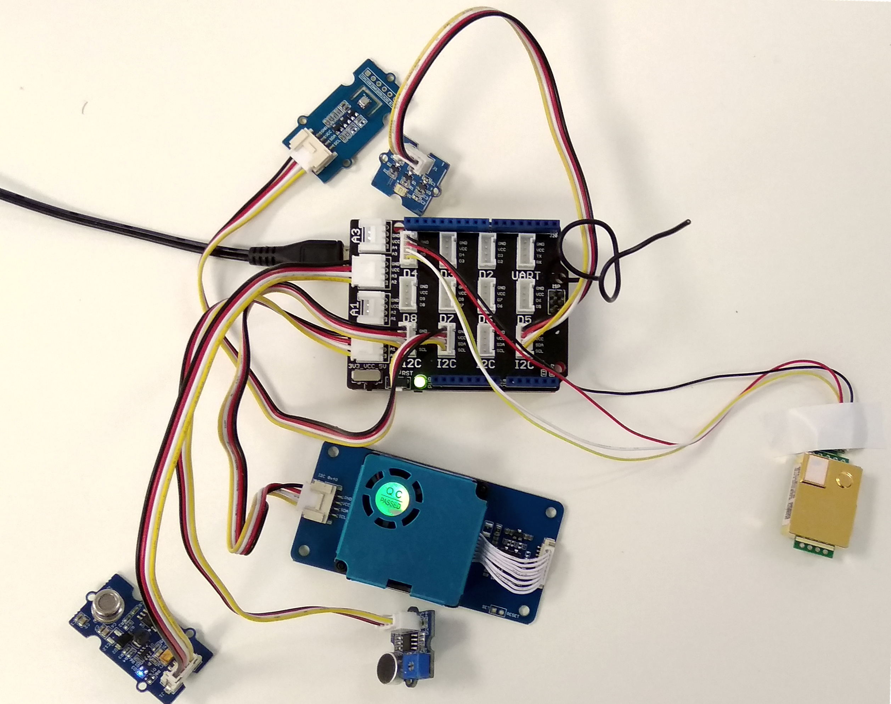

# Example node documentation

This sensor node is made to showcase a use-case of LoRaWAN for indoor ambience monitoring. For achieving this a multitude of sensors were used which can monitor the quality of the ambience. In this we measure parameters such as temperature, humidity, air pressure, air quality, loudness, gas, PM2.5,and light. 


## Hardware

To realize the objective, following components were used:

-Seeeduino LoRaWAN board V4.2
-Grove Base Shield Arduino V2
-Grove - Air Quality Sensor
-Grove - Loudness Sensor
-Grove - Digital Light Sensor
-Grove - BME680 Sensor
-Grove - Laser PM2.5 Sensor (HM3301)
-MHZ19B CO2 Sensor
-Micro USB Charger



### Wiring setup
First of all, the grove base shield was connected over the Seeeduino board. The board was set at the 5V mode. Then, the sensor connections were made as following:

-Loudness Sensor – Analog Pin A0
-PM 2.5 Sensor – I2C pin
-Digital Light Sensor – I2C pin
-BME680 Sensor – I2C pin
-MHZ19B CO2 Sensor – Digital Pin D4
-Air Quality Sensor - A2


Once all these connection were made, the board is connected with a computer using a USB cable. Further, software part needs to be followed:

## Software

To create this node, we use Arduino IDE for setting up the Seeeduino LoRaWAN device. First, install the [Seeeduino LoRaWAN](http://wiki.seeedstudio.com/Seeeduino_LoRAWAN/) board to your Arduino IDE and select the correct port. Then following libraries needs to be installed before compiling the code:

-[Digital_Light_TSL2561.h](https://github.com/Seeed-Studio/Grove_Digital_Light_Sensor/archive/master.zip) for Digital Light Sensor
-[Air_Quality_Sensor.h](https://github.com/Seeed-Studio/Grove_Air_quality_Sensor) for Air Quality Sensor 
-[Seeed_bme680.h](http://wiki.seeedstudio.com/How_to_install_Arduino_Library) for BME680 Sensor
-[Seeed_HM330X.h](https://github.com/Seeed-Studio/Seeed_PM2_5_sensor_HM3301) for Laser PM2.5 Sensor 
-[MHZ19.h](https://github.com/strange-v/MHZ19) for MHZ19B CO2 Sensor
-[Wire.h](https://github.com/esp8266/Arduino/tree/master/libraries/Wire) to communicate with I2C devices
-[SoftwareSerial.h](https://github.com/PaulStoffregen/SoftwareSerial) for Serial Communication
-[RTCZero.h](https://github.com/arduino-libraries/RTCZero) for controlling internal clock for time
-[CayenneLPP.h](https://github.com/ElectronicCats/CayenneLPP/archive/master.zip) for Cayenne Protocol

Apart from this LoRaWan.h library is also used but it is bundled within Seeeduino Board and is not required to be separately installed.

Now download and run the [Arduino_Sketch_Indoor.ino](Arduino_Sketch_Indoor/Arduino_Sketch_Indoor.ino) file in the Arduino IDE. This code was created by merging the example code of each of these attached sensor and the ttn-otaa example from the Seeeduino board. Some required changes were made while merging the example codes. For example, as there are multiple sensors each needs to be defined with a unique name. So, here HM330X was named as sensor while AirqualitySensor as sensors.
```
AirQualitySensor sensors(A2);

SoftwareSerial ss(4,5); 
/**
The number 4 and 5 here represents the RX and TX pin number respectively for digital pin D4.
**/
MHZ19 mhz(&ss);

#define BME_SCK 13
#define BME_MISO 12
#define BME_MOSI 11
#define BME_CS 10

#define IIC_ADDR  uint8_t(0x76)
Seeed_BME680 bme680(IIC_ADDR);

int loudness;

HM330X sensor;
```

## Services

This node is connected using the TheThingsNetwork service. Further, a node-red work bench is used to forward this collected data from the TTN platform to the OGC Sensor Things API configured on the FROST Server. The node-red workbench that was used for forwarding the data is available at [Node Red flow for Indoor Ambience Monitoring](/Node_flow_Indoor.json). To use this node-red-workbench go to the node-red platform https://iot.gis.bgu.tum.de:1885/, login with the credentials, go to the options and select Import>Clipboard. Select the downloaded .json file with the given option and click on import. Make necessary changes and deploy the flow.

Datastreams setup for this sensor node on the FROST server can be seen at:
http://iot.gis.bgu.tum.de:8081/FROST-Server-gi3/v1.0/Things(21)/Datastreams

The node-red workbench for this sensor node could be found at: https://iot.gis.bgu.tum.de:1885/#flow/7d5c6b14.d2af94

The GRAFANA dash-board for visualizing the collected data is available at:
https://iot.gis.bgu.tum.de:3050/d/jDJ1li1Wz/indoor-ambient-monitoring-with-seeeduino-lorawan-and-sensors?orgId=1

## References

* [Arduino_Sketch_Indoor.ino](Arduino_Sketch_Indoor/Arduino_Sketch_Indoor.ino)
* [Node Red flow for Indoor Ambience Monitoring](/Node_flow_Indoor.json)
