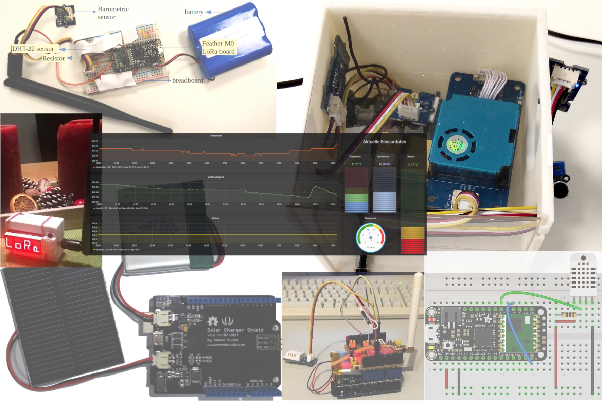

# TUM-GIS Sensor nodes

This repo contains documentation, Arduino sketches, and images of our
sensor nodes and the sensor services we used.

**Please view this documentation on [ReadTheDocs.io](https://tum-gis-sensor-nodes.readthedocs.io/) for best experience.**
The versions available are listed below.

## Versions

* [v0.0.1](https://tum-gis-sensor-nodes.readthedocs.io/en/v0.0.1/) - Relese v0.0.1
* [latest](https://tum-gis-sensor-nodes.readthedocs.io/en/latest/) - Build from master branch, includes latest updates

-------------------------------------------------------------------------------

