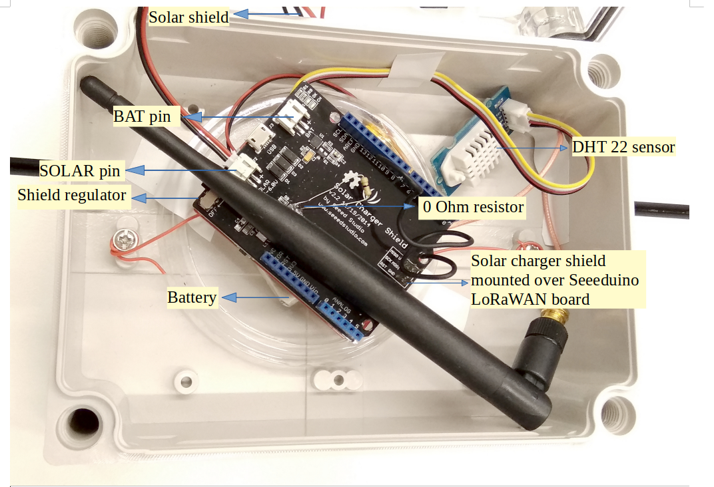

# Solar powered LoRa Sensor node

This sensor node is made to showcase a use-case of LoRaWAN sensor node powered using a solar panel. For achieving this a Seeeduino LoRaWAN microcontroller was used along with a solar panel connected using a solar shield. To show a generic use-case we have used a temperature and humidity sensor in this case, but it can be easily replaced with some other sensor as well. The entire setup was carefully placed in the [ABS Waterproof case](https://www.aliexpress.com/item/32806344313.html) which is an easy to install water-proof and dust-proof case for an indoor or outdoor sensor installations. However, this case has no provision for the ventilation unlike the [TFA case](https://www.tfa-dostmann.de/en/produkt/protective-cover-for-outdoor-transmitter/) and so the readings obtained by the sensor may not accurately represent the outdoor weather conditions. In this example, we measure parameters such as temperature, humidity, and battery voltage.

|  | 
|:--:| 
| *Sensor node in ABS Waterproof case* |

## Hardware

To build this sensor node we have used following hardware components:

- [Seeeduino LoRaWAN board V4.2](http://wiki.seeedstudio.com/Seeeduino_LoRAWAN/)
- [Grove - DHT-22 Temperature & Humidity Sensor](http://wiki.seeedstudio.com/Grove-Temperature_and_Humidity_Sensor_Pro/) 
- [Solar charger shield](http://wiki.seeedstudio.com/Solar_Charger_Shield_V2.2/)
- [1.5 W Solar panel](https://www.seeedstudio.com/1-5W-Solar-Panel-81X137.html)
- [0 ohm resistor](http://www.learningaboutelectronics.com/Articles/Zero-ohm-resistors)
- [ABS Waterproof case](https://www.aliexpress.com/item/32806344313.html)
- [2000 mAH Battery](https://www.adafruit.com/product/2011)

### Wiring setup

First of all, the solar panel is connected with the SOLAR pin and a battery is connected with a BAT pin on the solar charger shield as shown in the figure below. A DHT-22 Sensor is connected to A2 pin on the Seeeduino board using a connector cable and then the solar charger shield prepared in the previous step is mounted on the board. 

|  | 
|:--:| 
| *Solar shield connections with the solar panel and a battery* |

Apart from this, to measure the voltage of Lipo Battery we need to connect the VBAT pin to Analog pin A0, so that we can read the data from A0 pin. To achieve this, we need to Short R7 using a 0ohm resistor as shown in the figure here.

|  | 
|:--:| 
| *Short R7 using a 0 ohm resistor for battery voltage measurement* |

Final hardware setup looked as following:

|  | 
|:--:| 
| *Final hardware wiring setup* |

Once all these connection were made, the board is connected with a computer using a USB cable. Further, steps of software part needs to be followed:

## Software

To create this node, we use Arduino IDE for setting up the Seeeduino LoRaWAN device. First, install the [Seeeduino LoRaWAN](http://wiki.seeedstudio.com/Seeeduino_LoRAWAN/) board to your Arduino IDE and select the correct port. Then following libraries needs to be installed before compiling the code:

- [Wire.h](https://github.com/esp8266/Arduino/tree/master/libraries/Wire) to communicate with I2C devices.
- [DHT.h](https://github.com/Seeed-Studio/Grove_Temperature_And_Humidity_Sensor) for reading DHT-22 sensor.
- [RTCZero.h](https://github.com/arduino-libraries/RTCZero) for controlling internal clock for time.
- [CayenneLPP.h](https://github.com/ElectronicCats/CayenneLPP/archive/master.zip) for Cayenne Protocol.

Apart from this LoRaWan.h library is also used but it is bundled within Seeeduino Board and is not required to be separately installed.

Now download and run the [Arduino_Sketch_Solar.ino](Arduino_Sketch_Solar/Arduino_Sketch_Solar.ino) file in the Arduino IDE. This code was created by merging the example code of both the sensors and the ttn-otaa example from the lmic library. Some required changes were made while merging the example codes. The user should change the network session key, app session key and device address in the code before compiling. These keys can be obtained from the TTN, SWM or other service providers.

```
// LoRaWAN NwkSKey, network session key
// This should be in big-endian (aka msb).
static const PROGMEM u1_t NWKSKEY[16] = {NETWORK_SESSION_KEY_HERE_IN_MSB_FORMAT};

// LoRaWAN AppSKey, application session key
// This should also be in big-endian (aka msb).
static const u1_t PROGMEM APPSKEY[16] = {APPLICATION_SESSION_KEY_HERE_IN_MSB_FORMAT};

// LoRaWAN end-device address (DevAddr)
// See http://thethingsnetwork.org/wiki/AddressSpace
// The library converts the address to network byte order as needed, so this should be in big-endian (aka msb) too.
static const u4_t DEVADDR = 0x260XXXXX   ; // <-- Change this address for every node!
```
Following is the example code that can be used to measure the battery voltage of the Seeed solar charger shield:
```
// These constants won't change.  They're used to give names
// to the pins used:
const int analogInPin = A0;  // Analog input pin that the VBAT pin is attached to


int BatteryValue = 0;        // value read from the VBAT pin
float outputValue = 0;        // variable for voltage calculation

void setup() {
    // initialize serial communications at 9600 bps:
    Serial.begin(9600);
}

void loop() {
    // read the analog in value:
    BatteryValue = analogRead(analogInPin);
    // Calculate the battery voltage value
    outputValue = (float(BatteryValue)*5)/1023*2;
    // print the results to the serial monitor:
    Serial.print("Analog value = " );
    Serial.print(BatteryValue);
    Serial.print("\t voltage = ");
    Serial.println(outputValue);
    Serial.println("V \n");

    // wait 10 milliseconds before the next loop
    // for the analog-to-digital converter to settle
    // after the last reading:
    delay(10);
}
```

## Services

This node is connected using the TheThingsNetwork service. Further, a node-red work bench is used to forward this collected data from the TTN platform to the OGC Sensor Things API configured on the FROST Server. The node-red workbench that was used for forwarding the data is available at [Node Red flow for Solar powered Seeeduino](./Node_flow_Solar.json). To use this node-red-workbench go to the node-red platform https://iot.gis.bgu.tum.de:1885/, login with the credentials, go to the options and select Import>Clipboard. Select the downloaded .json file with the given option and click on import. Make necessary changes and deploy the flow.

Datastreams setup for this sensor node on the FROST server can be seen at:
http://iot.gis.bgu.tum.de:8081/FROST-Server-gi3/v1.0/Things(19)/Datastreams

The node-red workbench for this sensor node could be found at: https://iot.gis.bgu.tum.de:1885/#flow/58838bc1.4ce6a4

The GRAFANA dash-board for visualizing the collected data is available at:
https://iot.gis.bgu.tum.de:3050/d/TfCVFRNWz/solar-powered-seeeduino-with-dht22?orgId=1&refresh=10s

## References

* [Arduino_Sketch_Solar.ino](Arduino_Sketch_Solar/Arduino_Sketch_Solar.ino)
* [Node Red flow for Solar powered Seeeduino](./Node_flow_Solar.json)
* [Wiki guide for Seeeduino LoRaWAN board](http://wiki.seeedstudio.com/Seeeduino_LoRAWAN/)
* [Adding Seeed boards to Arduiono IDE](http://wiki.seeedstudio.com/Seeed_Arduino_Boards/)
* [Seeed Solar charger shield guide](http://wiki.seeedstudio.com/Solar_Charger_Shield_V2.2/)
