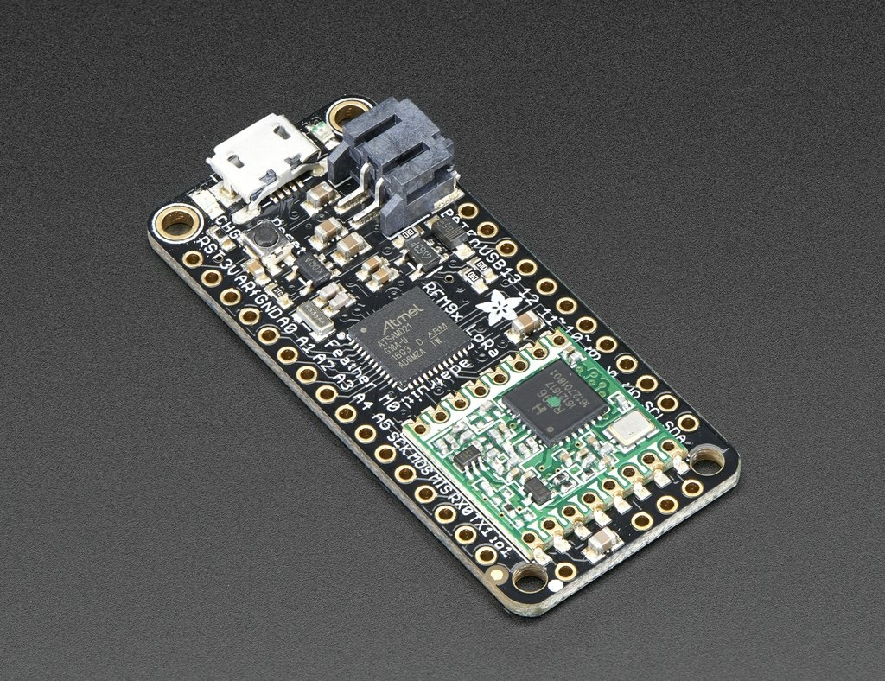
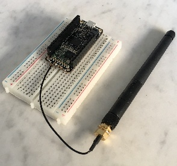
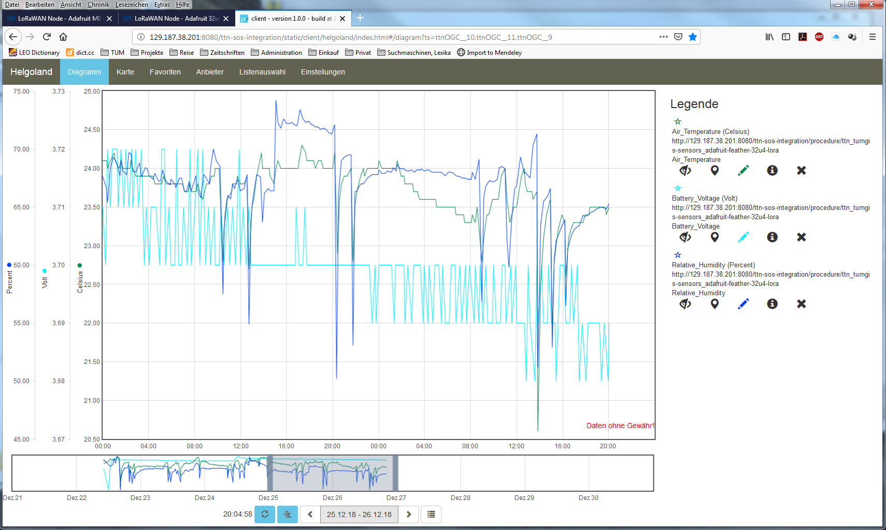

Adafruit M0 LoRa
================

Hardware
--------

Microcontroller
^^^^^^^^^^^^^^^

  `Feather M0 with RFM95 LoRa Radio - 900 MHz - RadioFruit <https://www.adafruit.com/product/3178>`_
  from Adafruit. `Feather M0 LoRa tutorial <https://learn.adafruit.com/adafruit-feather-m0-radio-with-lora-radio-module/downloads>`_
  with explanations, datasheets, and examples.

The Adafruit Feather M0 LoRa board is operated by the 32bit
ATSAMD21G18 ARM Cortex M0 microcontroller running at 48MHz.
It has 256 KB flash memory (to store the program code) and
32 KB of RAM (to store variables, status information, and
buffers). The operating voltage of the board is 3.3V (this
is important when attaching sensors and other peripherals;
they also must operate on 3.3V). The board offers 20 general
purpose digital input/output pins (20 GPIOs) with 10 analog
input pins (with 12bit analog digital converters (ADC)), one
analog output pin, one serial port (programmable Universal
Asynchronous Receiver and Transmitter, UART), one I2C port,
one SPI port, one USB port. The board comes with an embedded
Lithium polymer battery management chip and status indicator
led, which allows to directly connect a 3.7V LiPo rechargeable
battery that will be automatically recharged when the board
is powered over its USB connector. The Adafruit Feather M0 LoRa
board is available in German shops from around 37 € to 45 €.

  The Adafruit Feather M0 RFM95 LoRa with attached antenna placed
  onto a prototyping breadboard. (On this photo the DHT22 sensor
  and the LiPo battery are missing; we will upload a new photo in the future)

The LoRa transmitter and receiver is encapsulated within an
RFM95 module from the company HopeRF. This module uses the
LoRa chip SX1276 from the company Semtech and is dedicated
to the 868 MHz frequency band. The RFM95 module is connected
via SPI interface to the microcontroller. Most of the required
connections of the LoRa transceiver pins with the microcontroller
are already built-in on the Adafruit Feather M0 LoRa board.
However, Digital Pin 6 of the microcontroller must be connected
to DIO1 of the LoRa transceiver module in addition using a simple
wire. Since the module only implements the LoRa physical layer,
the LoRaWAN protocol stack must be implemented in software on
the microcontroller. We are using the Arduino library LMIC for
that purpose (see below). The implemented LoRaWAN functionality
is compatible with LoRaWAN Class A/C.

Sensor
^^^^^^

We have attached a DHT22 sensor to the microcontroller board,
which measures air temperature and humidity. The minimal time
interval between two measurements is 2 seconds. All data transfers
between the DHT22 and the microcontroller use a single digital
line. The sensor data pin is attached to a GPIO pin (here: Digital
Pin 12) of the microcontroller. In addition, a so-called pull-up
resistor of 4.7k to 10k Ohm must be connected between the data line
and VCC (+3.3V). The `DHT22 datasheet <https://www.sparkfun.com/datasheets/Sensors/Temperature/DHT22.pdf>`_
can be accessed here. A tutorial on how to use the DHT22 sensor with
Arduino microcontrollers is provided on `this page <https://learn.adafruit.com/dht?view=all>`_.
The sensor is available in German shops for around 4 € to 10 €.

Software
--------

The sensor node has been programmed using the `Arduino
IDE <https://www.arduino.cc/en/main/software>`_. Please
note, that in the Arduino framework a program is called a 'Sketch'.

Now download and run the :ref:`Arduino_Sketch_AdafruitM0LoRa.ino`
file in the Arduino IDE. After the sketch has successfully established
a connection to The Things Network it reports the air temperature,
humidity, and the voltage of a (possibly) attached LiPo battery
every 5 minutes. All three values are being encoded in two byte
integer values each and then sent as a 6 bytes data packet to the
respective TTN application using LoRaWAN port 7. Please note, that
LoRaWAN messages can be addressed to ports 1-255 (port 0 is reserved);
these ports are similar to port numbers 0-65535 when using the Internet
TCP/IP protocol. Voltage and humidity values are always greater or
equal to 0, but the temperature value can also become negative.
Negative values are represented as a two's complement; this must
be considered in the Payload Decoding Function used in The Things
Network (see `below <#ttn-payload-decoding>`_).

In between two sensor readings the microcontroller is going into
deep sleep mode to save battery power. With a 2000 mAh LiPo battery
and the current version of the sketch the system can run for at least
3 months. (Further optimizations would be possible, for example, not
switching on the LED on the microcontroller board during LoRa data
transmissions.)

The employed RFM95 LoRa module does not provide built-in support of
the LoRaWAN protocol. Thus, it has to be implemented on the ARM Cortex
M0 microcontroller. We use the IBM LMIC (LoraMAC-in-C) library for
Arduino, which can be downloaded from `this repository <https://github.com/matthijskooijman/arduino-lmic>`_.
The ARM Cortex M0
microcontroller has 256 KB of flash memory, which is plenty enough
for the LMIC library, the code dealing with the sensors, and even
some sophisticated analysis tasks (if required). The source code
is given in the following listing:

Note, that the source code is very similar to the source code for
the Adafruit Feather 32u4 LoRa board given on the Wiki page LoRaWAN
Node - Adafruit 32u4 LoRa. The source code for the Adafruit Feather
32u4 LoRa board has also more detailed comments. It is planned to
merge them into a single source code that can be used and compiled
for both types of microcontrollers (ATmega32u4 and ARM Cortex M0).
The merged source code is already available from LoRaWAN Node -
Adafruit 32u4 LoRa, but was not tested with the M0 microcontroller
board yet.

Note also, that there is an open issue regarding the deep sleep
mode on the ARM Cortex M0 microcontroller in the source code above.
During deep sleep mode the (software) timers of the LMIC library are
not incremented and after wake-up the library does not recognize that
enough time has passed to allow sending another data packet. This
built-in mechanism of the LMIC library should ensure that the sensor
node does not exceed the maximum duty cycle for LoRaWAN of 1%. This
somehow also affects the waiting time for a possible downlink data
packet coming from the gateway. As a consequence, the sensor node is
not only active for around 2.5 seconds (0.5 seconds to submit the most
recent datapacket to the gateway (uplink) and 2 seconds to wait for
possible downlink data packets), but sometimes for about 5-6 seconds
before it goes back into deep sleep mode (this can be seen from the
duration the red LED is activated on the board). These extra seconds
awake (with the LED and the LoRa  transceiver module switched on)
reduce battery lifetime significantly. The ATmega32u4 microcontroller
does not have these problems and can go faster back to deep sleep mode.
As a result the Adafruit Feather 32u4 LoRa board can run with a 1000 mAh
LiPo battery for 5 months and the Adafruit Feather M0 LoRa board with
a 2000 mAh LiPo battery for only 3 months.

Services
--------

The services used for this sensor-node are:

- `TheThingsNetwork <#registration-of-the-sensor-node-with-the-things-network-ttn>`_ service for LoRaWAN network service.
- `TheThingsNetwork - OGC SensorWeb <#the-things-network-ogc-sensorweb-integration>`_ integration for uploading LoRaWAN sensor data into OGC infrastructure.

Registration of the sensor node with The Things Network (TTN)
^^^^^^^^^^^^^^^^^^^^^^^^^^^^^^^^^^^^^^^^^^^^^^^^^^^^^^^^^^^^^

The LoRaWAN protocol makes use of a number of different identifiers,
addresses, keys, etc. These are required to unambiguously identify
devices, applications, as well as to encrypt and decrypt messages.
The names and meanings are nicely explained on a `dedicated TTN
web page <https://www.thethingsnetwork.org/docs/lorawan/address-space.html>`_.

The sketch given above connects the sensor node with The Things
Network (TTN) using the Activation-by-Personalisation (ABP) mode.
In this mode, the required keys for data encryption and session
management are created manually using the `TTN
console <https://console.thethingsnetwork.org>`_ window and
must be pasted into the source code of the sketch provided in
`software section <#software>`_ . In order to get this running, you
will need to create a new device <https://www.thethingsnetwork.org/docs/devices/registration.html>`_
in the TTN console window. This assumes that you already have a
TTN user account (which needs to be created otherwise). In the
settings menu of the newly created device the ABP mode must be
selected and the settings must be saved. Then copy the DevAddr,
the NwkSKey, and the AppSKey from the TTN console web page of
the newly registered device and paste them into the proper
places in the sketch above. Please make sure that you choose
for each of the three keys the correct byte ordering (MSB
for all three keys). A detailed explanation of these steps is
`given here <https://learn.adafruit.com/the-things-network-for-feather?view=all>`_.
Then the sketch can be compiled and uploaded to the Adafruit Feather
M0 LoRa microcontroller.

**Important hint**: everytime the sensor node is reset or being
started again, make sure to reset the frame counter of the
registered sensor in the TTN console web page of the registered
device. The reason is that in LoRaWAN all transmitted data
packets have a frame counter, which is incremented after each
data frame being sent. This way a LoRaWAN application can avoid
receiving and using the same packet again (replay attack).
When TTN receives a data packet, it checks if the frame number
is higher than the last one received before. If not, the
received packet is considered to be old or a replay attack and
is discarded. When the sensor node is reset or being started
again, its frame counter is also reset to 0, hence, the TTN
application assumes that all new packages are old, because
their frame counter is lower than the last frame received
(before the reset). A manual frame counter reset is only
necessary when registering the node using ABP mode. In OTAA
mode the frame counter is automatically reset in the sensor
node and the TTN network server.

TTN Payload Decoding
^^^^^^^^^^^^^^^^^^^^

Everytime a data packet is received by a TTN application a
dedicated Javascript function is being called (Payload Decoder
Function). This function can be used to decode the received
byte string and to create proper Javascript objects or values
that can directly be read by humans when looking at the incoming
data packet. This is also useful to format the data in a
specific way that can then be forwarded to an external
application (e.g. a sensor data platform like `MyDevices
<https://mydevices.com/>`_ or `Thingspeak <https://thingspeak.com/>`_ ).
Such a forwarding can be configured in the TTN console in the
"Integrations" tab. :ref:`TTN_Payload_Decoder` given here checks
if a packet was received on LoRaWAN port 7 and then assumes that
it consists of the 6 bytes encoded as described above.
It creates the three Javascript objects 'temperature', 'humidity',
and 'vbattery'. Each object has two fields: 'value' holds the
value and 'uom' gives the unit of measure. The source code can
simply be copied and pasted into the 'decoder' tab in the TTN
console after having selected the application. Choose the
option 'Custom' in the 'Payload Format' field. Note that when
you also want to handle other sensor nodes sending packets on
different LoRaWAN ports, then the Payload Decoder Function can
be extended after the end of the  if (port==7) {...} statement
by adding  else if (port==8) {...} else if (port==9) {...} etc.

The Things Network - OGC SensorWeb Integration
^^^^^^^^^^^^^^^^^^^^^^^^^^^^^^^^^^^^^^^^^^^^^^

The presented Payload Decoder Function works also with the
TTN-OGC SWE Integration for the `52° North Sensor Observation
Service (SOS) <https://github.com/52North/SOS>`_. This software
component can be downloaded from this `repository <https://github.com/52North/ttn-ogcswe-integration>`_.
It connects a TTN application with a running transactional
`Sensor Observation Service 2.0.0 (SOS) <https://www.opengeospatial.org/standards/sos>`_. Data packets received
from TTN are imported into the SOS. The SOS persistently stores
sensor data from an arbitrary number of sensor nodes and can
be queried for the most recent as well as for historic sensor
data readings. The 52° North SOS comes with its own REST API
and a nice web client allowing to browse the stored sensor
data in a convenient way.

We are running an instance of the 52° North SOS and the TTN-OGC
SWE Integration. The web client for this LoRaWAN sensor node can
be accessed `on this page <http://129.187.38.201:8080/ttn-sos-integration/static/client/helgoland/index.html#/diagram?ts=ttnOGC__10,ttnOGC__11,ttnOGC__9>`_.
Here is a screenshot showing the webclient: (Note that the sensor
node was wrongly registered with TTN using the name adafruit-feather-32u4-lora
- it should have been adafruit-feather-m0-lora. Hence, while the
legend says it is a 32u4 microcontroller in fact it is the M0)

  Web client for data visualization

Code files
----------

.. literalinclude:: Arduino_Sketch_AdafruitM0LoRa/Arduino_Sketch_AdafruitM0LoRa.ino
   :language: arduino
   :linenos:
   :caption: Arduino Sketch for Adafruit M0 LoRa sensor node
   :name: Arduino_Sketch_AdafruitM0LoRa.ino

.. literalinclude:: TTN_Payload_Decode.js
   :language: Javascript
   :linenos:
   :caption: TTN payload decoder for Adafruit M0 LoRa sensor node
   :name: TTN_Payload_Decoder

References
----------

- `Adafruit Feather M0 LoRa microntroller <https://www.adafruit.com/product/3178>`_
- `Adafruit Feather M0 LoRa tutorial <https://learn.adafruit.com/adafruit-feather-m0-radio-with-lora-radio-module>`_
- `IBM LMIC (LoraMAC-in-C) library for Arduino <https://github.com/matthijskooijman/arduino-lmic>`_
- `Adafruit feather m0 lora 900 end-to-end instructions - End Devices (Nodes) - The Things Network <https://www.thethingsnetwork.org/forum/t/adafruit-feather-m0-lora-900-end-to-end-instructions/10759>`_
- `Getting Started with AdaFruit Feather M0 LoRa - Telenor Start IoT <https://startiot.telenor.com/learning/getting-started-with-adafruit-feather-m0-lora/>`_
- `GitHub - mcci-catena/arduino-lorawan: User-friendly library for using Feather M0 LoRa with The Things Network and LoRaWAN™ <https://github.com/mcci-catena/arduino-lorawan>`_
- `GitHub - marcuscbehrens/loralife: source code associated with https://www.meetup.com/Internet-of-Things-IoT-LoRaWan-Infrastruktur-4-RheinNeckar/ <https://github.com/marcuscbehrens/loralife>`_
- `Workshop — LoRaTAS <https://www.loratas.io/blog/2017/11/30/workshop>`_
- `mikenz/Feather_M0_LoRa: Example Arduino code of using an Adafruit Feather M0 LoRa module to send sensor data <https://github.com/mikenz/Feather_M0_LoRa>`_
- `TTN Ulm - LoRaWAN und LoRa in Ulm | Verkehrszählung mit LoRaWAN und TTN <https://lora.ulm-digital.com/documentation/traffic>`_

**On battery saving / using the deep sleep mode**

- `Full Arduino Mini LoraWAN and 1.3uA Sleep Mode - End Devices (Nodes) - The Things Network <https://www.thethingsnetwork.org/forum/t/full-arduino-mini-lorawan-below-1ua-sleep-mode/8059/97>`_
- `Adding Method to Adjust hal_ticks Upon Waking Up from Sleep · Issue #109 · matthijskooijman/arduino-lmic <https://github.com/matthijskooijman/arduino-lmic/issues/109>`_
- `minilora-test/minilora-test.ino at cbe686826bd84fac8381de47b5f5b02dd47c2ca0 · tkerby/minilora-test <https://github.com/tkerby/minilora-test/blob/cbe686826bd84fac8381de47b5f5b02dd47c2ca0/minilora-test/minilora-test.ino#L190>`_
