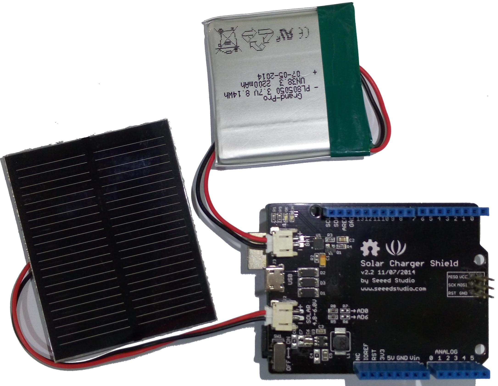

Dragino LoRa Arduino Shield
===========================

This tutorial is made to showcase the use of Dragino LoRa Arduino board
to create a LoRaWAN enabled sensor node. In the following example,
a temperature and humidity sensor was used with the Dragino LoRa
board.

Hardware
--------

Microcontroller
^^^^^^^^^^^^^^^

  `LoRa/GPS Shield <http://www.dragino.com/products/lora/item/108-lora-gps-shield.html>`_
  from Dragino. `LoRa/GPS Shield Wiki <http://wiki.dragino.com/index.php?title=Lora/GPS_Shield>`_
  with explanations, datasheets, and examples.

The employed microcontroller board is an `Arduino Uno R3 <https://store.arduino.cc/arduino-uno-rev3>`_
variant (i.e. it is a cheap clone of the Arduino Uno R3).
It is operated by the 8bit ATmega328 microcontroller running
at 16MHz. It has 32 KB flash memory (to store the program
code), 1 KB EEPROM (to store configuration data), and 2 KB
of RAM (to store variables, status information, and buffers).
The operating voltage of the board is 5V (this is important
when attaching sensors and other peripherals; they also must
operate on 5V). The board offers 20 general purpose digital
input/output pins (20 GPIOs) of which 6 can be used as analog
input pins (with 10bit analog digital converters (ADC)) and
6 as PWM outputs, one serial port (programmable Universal
Asynchronous Receiver and Transmitter, UART), one I2C port,
one SPI port, one USB port (which is attached to a USB/Serial
converter that is connected to the hardware serial port).
Arduino Uno R3 compatible boards are available in German shops
from around 5 € to 10 €. The original Arduino Uno R3 board
costs around 22 €.

The `Dragino LoRa/GPS Shield <http://wiki.dragino.com/index.php?title=Lora/GPS_Shield>`_
runs on 5V and is directly attached to the connectors of
the Arduino Uno R3 microcontroller board. It comes with
a built-in LoRa transmitter and receiver chip SX1276 from
the company Semtech that is dedicated to the 868 MHz
frequency band. The SX1276 module is connected via SPI
interface to the microcontroller. For that purpose, Lora
CLK, Lora D0, and Lora DI must be jumpered to SCK, MISO,
and MOSI respectively (on the left side of the Dragino
shield when looking on the top side of the shield with
the Antenna connectors showing to the right). Lora DIO1
and Lora DIO2 must be jumpered to Arduino Digital Pin 6
and Pin 7 respectively. Since the module only implements
the LoRa physical layer, the LoRaWAN protocol stack must
be implemented in software on the microcontroller. We are
using the Arduino library LMIC for that purpose (see below).
The implemented LoRaWAN functionality is compatible with
LoRaWAN Class A/C.

The board also contains a `Quectel L80 GPS module <https://www.quectel.com/product/l80.htm>`_
(based on the MTK MT3339 GPS receiver) with a built-in
antenna. According to the Dragino Wiki "this GPS module
can calculate and predict orbits automatically using the
ephemeris data (up to 3 days) stored in internal flash
memory, so the shield can fix position quickly even at
indoor signal levels with low power consumption". The
GPS module has a serial UART interface that can be
connected in different ways to the Arduino microcontroller.
The default data transmission rate is 9600 baud, the default
position reporting rate is 1s (1 Hz). The module is capable
to report up to 10 positions per second (10 Hz). Supported
protocols are `NMEA 0183 <https://en.wikipedia.org/wiki/NMEA_0183>`_
and `MediaTek PMTK <https://cdn.sparkfun.com/assets/parts/1/2/2/8/0/PMTK_Packet_User_Manual.pdf>`_.
Note that the ATmega328 microcontroller has only one hardware
serial UART interface and this is already connected via a
USB/Serial converter to the USB port of the Arduino board.
In order to attach the serial interface of the GPS module
to the microcontroller two general purpose IO lines (GPIOs)
are being used and the serial protocol is implemented in
software. The GPS_RXD pin on the Dragino Shield must be
connected to Arduino Digital Pin 4 and the GPS_TXD pin
to Digital Pin 3 using two wires. No jumpers must be
present for GPS_RXD and GPS_TXD (besides the two wires
mentioned above to Digital Pins 4 and 3). The Dragino
LoRa/GPS Shield is available in German shops for around
34 € to 40 €.

  `Solar Charger Shield V2.2 from Seeedstudio. <http://www.dragino.com/products/lora/item/108-lora-gps-shield.html>`_

Since the Arduino Uno R3 board normally has to be powered
externally via the USB port or the power connector, we have
added the `Solar Charger Shield V2.2 <http://wiki.seeedstudio.com/Solar_Charger_Shield_V2.2/>`_
from the company Seeedstudio. This shield is directly attached
to the connectors of the Arduino Uno R3 microcontroller board
and sits in-between the Arduino board (bottom) and the LoRa/GPS
Shield (top). A lithium polymer LiPo battery with 3.7V can be
attached to the shield. The 3.7V of the battery is transformed
to 5V as required by the Arduino microcontroller board. The
battery is automatically recharged when the Arduino board is
powered externally (over USB or the power connector). Also a
photovoltaic panel with 4.8-6V can be attached to the shield
to recharge the battery. The  Solar Charger Shield V2.2 can
report the current battery voltage level. For that purpose we
had to solder a bridge on the shield at the connector marked
as 'R7'. Over a voltage divider the battery anode is connected
to Analog Pin A0 and can be queried using the built-in analog/digital
converter. The Solar Charger Shield V2.2 is available in German
shops for around 12 € to 18 €.

Sensor
^^^^^^

We have attached a DHT22 sensor to the microcontroller board,
which measures air temperature and humidity. The minimal time
interval between two measurements is 2 seconds. All data
transfers between the DHT22 and the microcontroller use a
single digital line. The sensor data pin is attached to a GPIO
pin (here: Digital Pin 5) of the microcontroller. In addition,
a so-called pull-up resistor of 4.7k to 10k Ohm must be connected
between the data line and VCC (+3.3V). The `DHT22 datasheet
<https://www.sparkfun.com/datasheets/Sensors/Temperature/DHT22.pdf>`_
provides more technical details about the DHT22 Sensor. A
tutorial on how to use the `DHT22 sensor with Arduino
microcontrollers <https://learn.adafruit.com/dht?view=all>`_ is
provided here. The sensor is available in German shops for
around 4 € to 10 €.

 .. figure:: Dragino_LoRa_GPS_Shield_with_DHT22.jpg
  :width: 100 %
  :align: center

  The Arduino Uno R3 (bottom) with attached Solar Charger Shield
  and a 2000 mAh lithium polymer LiPo battery (middle), the Dragino
  LoRa/GPS Shield with attached antenna (top), and an attached DHT22
  temperature / humidity sensor (white box on the left).

Software
--------

The sensor node has been programmed using the `Arduino
IDE <https://www.arduino.cc/en/main/software>`_. Please note,
that in the Arduino framework a program is called a 'Sketch'.

After the sketch has successfully established a connection to
The Things Network it reports the air temperature, humidity,
and the voltage of a (possibly) attached LiPo battery every 5
minutes. All three values are being encoded in two byte integer
values each (in most significant byte order) and then sent as
a 6 bytes data packet to the respective TTN application using
LoRaWAN port 7. Please note, that LoRaWAN messages can be
addressed to ports 1-255 (port 0 is reserved); these ports are
similar to port numbers 0-65535 when using the Internet TCP/IP
protocol. Voltage and humidity values are always greater or
equal to 0, but the temperature value can also become negative.
Negative values are represented as a `two's complement
<https://en.wikipedia.org/wiki/Two%27s_complement>`_; this must
be considered in the Payload Decoding Function used in The
Things Network (see `this section <#ttn-payload-decoding>`_).

The next eight bytes contain two 32 bit integer values (MSB) for
latitude and longitude . In order to a) provide enough precision
and b) avoid negative values, the original angles (given as decimal
fractions) are first added with an offset (90.0 degrees for the
latitude and 180.0 degrees for the longitude) and then multiplied
by 1,000,000. These transformations have to be reverted in the
Payload Decoding Function. The next two bytes represent a 16 bit
integer value for the altitude (MSB). The next byte contains the
current number of satellites seen by the GPS receiver. Note that
only when this number is greater or equal to 4 the provided GPS
position is a current one. Finally, the last two bytes contain a
16 bit integer value (MSB) for the battery voltage in centivolts
(this value will be divided by 100 in the Payload Decoding Function
to provide volts). The entire data packet is sent to the respective
TTN application using LoRaWAN port 9. Please note, that LoRaWAN
messages can be addressed to ports 1-255 (port 0 is reserved);
these ports are similar to port numbers 0-65535 when using the
Internet TCP/IP protocol.

Currently we are not making use of the sleep mode, because we have
to find out how to deal with the GPS receiver in conjunction with
deep sleep mode. This means that the board is constantly drawing a
significant amount of power reducing battery life considerably.
Using the current sketch the sensor node can operate roughly 6 hours
on battery power before it has to be recharged. Besides software
improvements there are also other possibilities to reduce power
consumption: the Arduino board and the Dragino LoRa/GPS Shield have
power LEDs which are constantly lit during operation. Furthermore,
the Dragino LoRa/GPS Shield has an indicator LED that blinks when
the GPS module is successfully receiving position fixes. These LEDs
could be desoldered to reduce the energy consumption of the sensor node.

The employed SX1276 LoRa module on the Dragino LoRa/GPS shield does
not provide built-in support of the LoRaWAN protocol. Thus, it has
to be implemented on the ATmega328 microcontroller. We use the IBM
LMIC (LoraMAC-in-C) library for Arduino, which can be downloaded
from `this repository <https://github.com/matthijskooijman/arduino-lmic>`_. Since the
ATmega328 microcontroller only has 32 KB of flash memory and the
LMIC library is taking most of it, there is only very limited code
space left for the application dealing with the sensors (about 2 KB).
Nevertheless, this is sufficient to query some sensors like in our
example the DHT22 and to decode the GPS data. The source code is
given in the following section: :ref:`Arduino_Sketch_dragino_lora.ino`

Services
--------

The services used for this sensor-node are:

- `TheThingsNetwork <#registration-of-the-sensor-node-with-the-things-network-ttn>`_ service for LoRaWAN network service.
- `TheThingNetwork- OGC SensorWeb Integration <#the-things-network-ogc-sensorweb-integration>`_

Registration of the sensor node with The Things Network (TTN)
^^^^^^^^^^^^^^^^^^^^^^^^^^^^^^^^^^^^^^^^^^^^^^^^^^^^^^^^^^^^^

The LoRaWAN protocol makes use of a number of different
identifiers, addresses, keys, etc. These are required to
unambiguously identify devices, applications, as well as to
encrypt and decrypt messages. The names and meanings are
`nicely explained on a dedicated TTN web page
<https://www.thethingsnetwork.org/docs/lorawan/addressing.html>`_.

The sketch given above connects the sensor node with The
Things Network (TTN) using the Activation-by-Personalisation
(ABP) mode. In this mode, the required keys for data encryption
and session management are created manually using the TTN
console window and must be pasted into the source code of the
sketch below. In order to get this running, you will need to
`create a new device in the TTN console window
<https://www.thethingsnetwork.org/docs/devices/registration.html>`_.
This assumes that you already have a TTN user account (which
needs to be created otherwise). In the settings menu of the
newly created device the ABP mode must be selected and the
settings must be saved. Then copy the DevAddr, the NwkSKey, and in
the AppSKey from the TTN console web page of the newly
registered device and paste them into the proper places in the
sketch above. Please make sure that you choose for each of the
three keys the correct byte ordering (MSB for all three keys).
A detailed explanation of these steps is given
`here <https://learn.adafruit.com/the-things-network-for-feather?view=all>`_.
Then the sketch can be compiled and uploaded to the Arduino
Uno R3 microcontroller.

**Important hint**: everytime the sensor node is reset or being
started again, make sure to reset the frame counter of the
registered sensor in the TTN console web page of the registered
device. The reason is that in LoRaWAN all transmitted data
packets have a frame counter, which is incremented after each
data frame being sent. This way a LoRaWAN application can avoid
receiving and using the same packet again (replay attack).
When TTN receives a data packet, it checks if the frame number
is higher than the last one received before. If not, the
received packet is considered to be old or a replay attack and
is discarded. When the sensor node is reset or being started
again, its frame counter is also reset to 0, hence, the TTN
application assumes that all new packages are old, because
their frame counter is lower than the last frame received
(before the reset). A manual frame counter reset is only
necessary when registering the node using ABP mode. In OTAA
mode the frame counter is automatically reset in the sensor
node and the TTN network server.

TTN Payload Decoding
^^^^^^^^^^^^^^^^^^^^

Everytime a data packet is received by a TTN application a
dedicated Javascript function is being called
(:ref:`TTN_Payload_Decoder_Dragino`). This function can be used
to decode the received
byte string and to create proper Javascript objects or values
that can directly be read by humans when looking at the incoming
data packet. This is also useful to format the data in a specific
way that can then be forwarded to an external application (e.g. a
sensor data platform like `MyDevices <https://mydevices.com/>`_
or `Thingspeak <https://thingspeak.com/>`_ ). Such a forwarding
can be configured in the TTN console in the "Integrations"
tab. The Payload Decoder Function given below checks if a packet
was received on LoRaWAN port 9 and then assumes that it consists
of the 17 bytes encoded as described above. It creates the seven
Javascript objects 'temperature', 'humidity', 'lat', 'lon',
'altitude', 'sat', and 'vbattery'. Each object has two fields:
'value' holds the value and 'uom' gives the unit of measure. The
source code can simply be copied and pasted into the 'decoder'
tab in the TTN console after having selected the application.
Choose the option 'Custom' in the 'Payload Format' field. Note
that when you also want to handle other sensor nodes sending
packets on different LoRaWAN ports, then the Payload Decoder
Function can be extended after the end of the  if (port==9)
{...} statement by adding   else if (port==7) {...} else if
(port==8) {...} etc.

The Things Network - OGC SensorWeb Integration
^^^^^^^^^^^^^^^^^^^^^^^^^^^^^^^^^^^^^^^^^^^^^^

The presented Payload Decoder Function works also with the
TTN-OGC SWE Integration for the `52° North Sensor Observation
Service (SOS) <https://github.com/52North/SOS>`_. This software
component can be downloaded from this `repository <https://github.com/52North/ttn-ogcswe-integration>`_.
It connects a TTN application with a running transactional
`Sensor Observation Service 2.0.0 (SOS) <https://www.opengeospatial.org/standards/sos>`_. Data packets received
from TTN are imported into the SOS. The SOS persistently stores
sensor data from an arbitrary number of sensor nodes and can
be queried for the most recent as well as for historic sensor
data readings. The 52° North SOS comes with its own REST API
and a nice web client allowing to browse the stored sensor
data in a convenient way.

We are running an instance of the 52° North SOS and the
TTN-OGC SWE Integration. The web client for this LoRaWAN
sensor node can be accessed `on this page <http://129.187.38.201:8080/ttn-sos-integration/static/client/helgoland/index.html#/diagram?ts=ttnOGC__13,ttnOGC__15,ttnOGC__14,ttnOGC__17,ttnOGC__18,ttnOGC__12,ttnOGC__19>`_.
Here is a screenshot showing the webclient:

  Web client for data visualization

Code files
----------

.. literalinclude:: Arduino_Sketch_dragino_lora/Arduino_Sketch_dragino_lora.ino
   :language: arduino
   :linenos:
   :caption: Arduino Sketch for Dragino LoRa sensor node
   :name: Arduino_Sketch_dragino_lora.ino

.. literalinclude:: TTN_Payload_Decode.js
   :language: Javascript
   :linenos:
   :caption: TTN payload decoder for Dragino LoRa sensor node
   :name: TTN_Payload_Decoder_Dragino

References
----------

- `Arduino Uno R3 microcontroller <https://store.arduino.cc/arduino-uno-rev3>`_
- `FAQ on Arduino microcontrollers from Adafruit <https://learn.adafruit.com/arduino-tips-tricks-and-techniques/arduino-uno-faq>`_
- `Dragino Lora/GPS Shield Wiki <http://wiki.dragino.com/index.php?title=Lora/GPS_Shield>`_
- `Dragino Lora/GPS Shield github <https://github.com/dragino/Lora/tree/master/Lora%20GPS%20Shield>`_
- `Seeedstudio Solar Charger Shield V2.2 <http://wiki.seeedstudio.com/Solar_Charger_Shield_V2.2/>`_
- `IBM LMIC (LoraMAC-in-C) library for Arduino <https://github.com/matthijskooijman/arduino-lmic>`_
- `Connect to TTN - Wiki for Dragino Project <http://wiki.dragino.com/index.php?title=Connect_to_TTN#Use_LoRa_GPS_Shield_and_Arduino_as_LoRa_End_Device>`_
- `dragino/Arduino-Profile-Examples/Arduino_LMIC.ino GitHub <https://github.com/dragino/Arduino-Profile-Examples/blob/master/libraries/Dragino/examples/LoRa/LoRaWAN/Arduino_LMIC/Arduino_LMIC.ino>`_
- `dragino/Arduino-Profile-Examples/tinygps_example.ino GitHub <https://github.com/dragino/Arduino-Profile-Examples/blob/master/libraries/Dragino/examples/GPS/tinygps_example/tinygps_example.ino>`_
- `goodcheney/ttn_mapper/gps_shield at master GitHub <https://github.com/goodcheney/ttn_mapper/blob/master/gps_shield>`_

On battery saving / using the deep sleep mode (these are written
for other microcontroller boards, but do apply for the Arduino Uno R3
and the Dragino Lora/GPS Shield, too):

- `Adafruit Feather 32u4 LoRa - long transmission time after deep sleep - End Devices (Nodes) - The Things Network <https://www.thethingsnetwork.org/forum/t/adafruit-feather-32u4-lora-long-transmission-time-after-deep-sleep/11678/7 and https://www.thethingsnetwork.org/forum/t/adafruit-feather-32u4-lora-long-transmission-time-after-deep-sleep/11678/13>`_
- `Full Arduino Mini LoraWAN and 1.3uA Sleep Mode - End Devices (Nodes) - The Things Network <https://www.thethingsnetwork.org/forum/t/full-arduino-mini-lorawan-below-1ua-sleep-mode/8059/97>`_
- `Adding Method to Adjust hal_ticks Upon Waking Up from Sleep · Issue #109 · matthijskooijman/arduino-lmic <https://github.com/matthijskooijman/arduino-lmic/issues/109>`_
- `minilora-test/minilora-test.ino at cbe686826bd84fac8381de47b5f5b02dd47c2ca0 · tkerby/minilora-test <https://github.com/tkerby/minilora-test/blob/cbe686826bd84fac8381de47b5f5b02dd47c2ca0/minilora-test/minilora-test.ino#L190>`_
- `Arduino-LMIC library with low power mode - Mario Zwiers <https://mariozwiers.de/2018/04/04/arduino-lmic-library-with-low-power-mode/>`_
