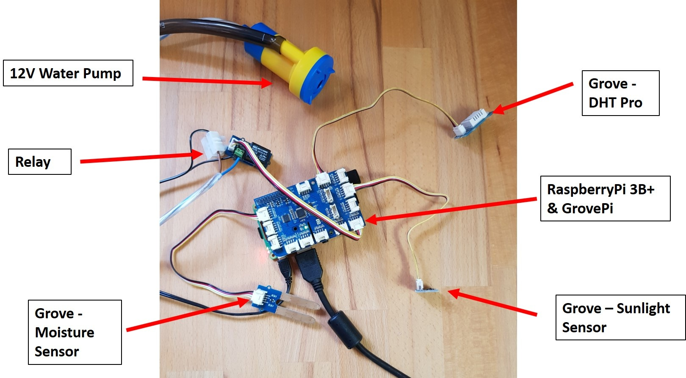
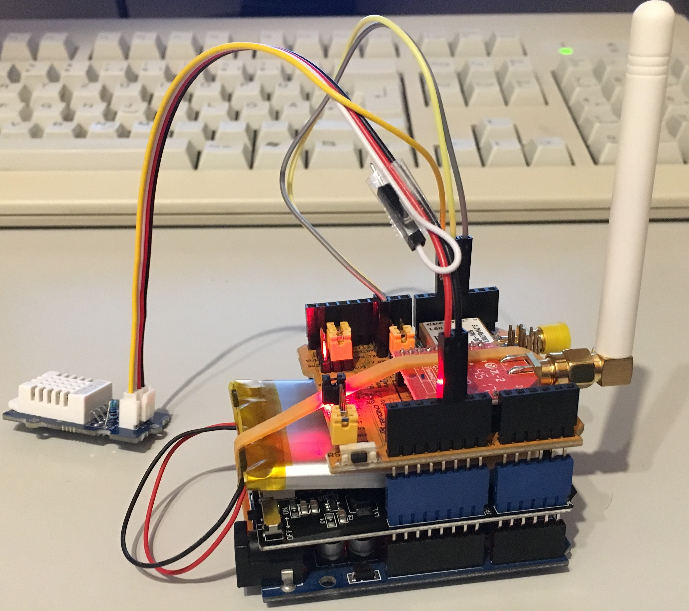

# Example node documentation

A brief description on **what this nodes is doing** should and an image of the final setup should be added here.



## Hardware

In this section the hardware setup is described in detail.
All used hardware components should (at least) be listed.
If something special (e.g. additional wiring, soldering, ...) was required to setup the hardware, this
should be described here as well.
**At least, add one image of the final hardware setup.** We want to see the hardware here. If a case is used, add both an image of the case and and the bare hardware.

### Example: Wiring setup

This is how to wire this extension board.



## Software

This section contains the software required for this node. Please
list at least all libraries used in the sketch.

The code/sketch added to this folder should be well-formatted and well-described using comments. Very important/complex code snippets should be explained here using code boxes.

```c++
#include <DHT.h>

void setup() {

    // no setup here

}

void loop()
{
    // ...
}

/**
  very complex method this described comprehensively here
**/
void flash(int nFlashes, int length) {
  for (int i=0; i < nFlashes; i++) {
    blink(length);
    delay(100);
  }
}
```

## Services

This section should contain a list of the services this node is using.
This could be e.g. URLs to the FROST server *sensors* and *data channels* of this node, an URL to a related *Node RED* workbench and an URL to a Grafana dashboard.

## References

* List useful **links**, **files**, ... here.
* Basically, everything that is helpful should be added here.
