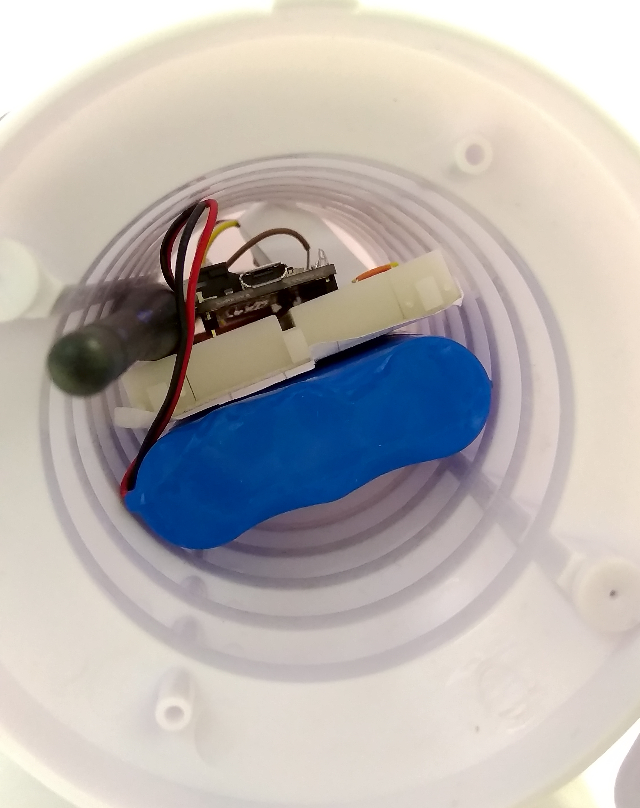
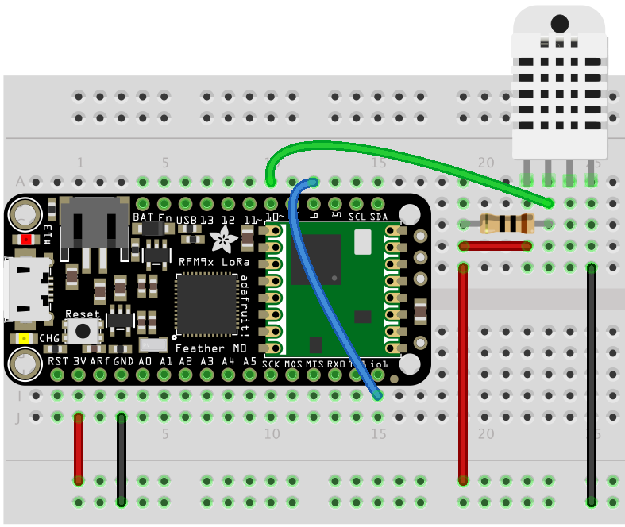
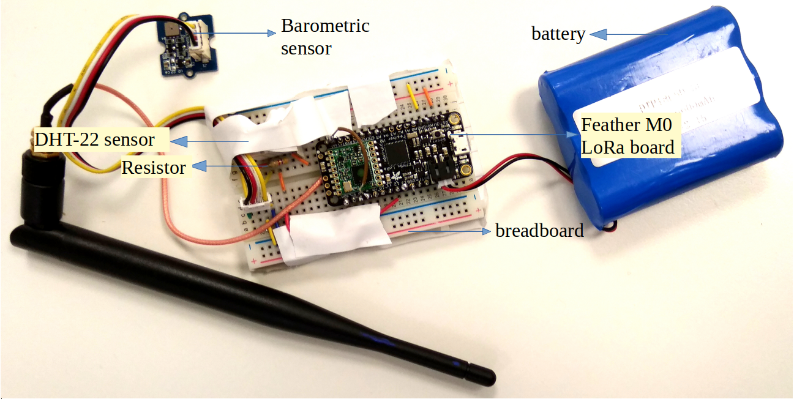

Feather M0 LoRa in TFA Housing
==============================

This sensor node is made to showcase a use-case of LoRaWAN technology
for outdoor weather monitoring. For achieving this a Feather M0 LoRa
module was used with temperature and pressure sensor. The entire setup
was carefully placed in the `TFA Housing <https://www.tfa-dostmann.de/en/produkt/protective-cover-for-outdoor-transmitter/>`_
which is an all-weather protective cover for outdoor transmitters.
In this example we measure parameters such as temperature, humidity,
altitude, and air pressure.

.. figure:: setup.jpg
  :width: 60 %
  :align: center

  Sensor node in TFA Housing.

Hardware
--------

To build this sensor node we have used following hardware components:

- `Adafruit Feather M0 LoRA board <https://learn.adafruit.com/adafruit-feather-m0-radio-with-lora-radio-module>`_
- `Grove - DHT-22 Temperature & Humidity Sensor <http://wiki.seeedstudio.com/Grove-Temperature_and_Humidity_Sensor_Pro/>`_
- `Grove - Barometric Pressure Sensor <http://wiki.seeedstudio.com/Grove-Barometer_Sensor/>`_
- `Breadboard <https://en.wikipedia.org/wiki/Breadboard#/media/File:400_points_breadboard.jpg>`_
- `TFA Protective Cover <https://www.tfa-dostmann.de/en/produkt/protective-cover-for-outdoor-transmitter/>`_
- `6600 mAH Battery <https://www.adafruit.com/product/353>`_

  Inside view of Sensor node in TFA Housing

Also, as the final hardware setup with antenna couldn’t completely fit
into the casing, a small hole was made at the bottom of the casing to
allow the remaining portion of antenna to stay outside.

.. figure:: setup-bottom.jpg
  :width: 60 %
  :align: center

  Bottom view of Sensor node in TFA Housing

Wiring setup
------------

First of all, the Feather M0 LoRa board was prepared by soldering
the board with the provided grid of pins. Then the board is connected
with the sensors using a breadboard. The sensor connections were made
using the connector cables as following:

DHT-22 Sensor connections:
^^^^^^^^^^^^^^^^^^^^^^^^^^

- Feather 3V to DHT22 pin 1
- Feather GND to DHT22 pin 4
- Feather pin 12 to DHT22 pin 2
- Resistor between DHT pin 1 and DHT pin 2

  Wiring with DHT-22 Sensor

Grove-Barometer Sensor connections:
^^^^^^^^^^^^^^^^^^^^^^^^^^^^^^^^^^^

- Feather SCL to Barometer Sensor pin 1 (yellow)
- Feather SDA to Barometer Sensor pin 2 (white)
- Feather 3V to Barometer Sensor pin 3 (red)
- Feather GND to Barometer Sensor pin 4 (black)

Apart from this, Feather pin 6 should be permanently wired with
Feather pin io1 as shown in the figure above.

To ensure the durable connections, smaller jumper wires were used
on the breadboard instead of longer connecting cables. Sensors and
cables were also supported with an insulating duct tape.

Final hardware setup looked as following:

  Final hardware wiring

Once all these connection were made, the board is connected with a computer
using a USB cable. Further, steps of software part needs to be followed.

Software
--------

To create this node, we use Arduino IDE for setting up the Feather
M0 LoRa module. First, install the `Feather M0 LoRa <https://learn.adafruit.com/adafruit-feather-m0-radio-with-lora-radio-module/setup>`_
board to your Arduino IDE and select the correct port. Then following
libraries needs to be installed before compiling the code:

- `lmic.h <https://github.com/matthijskooijman/arduino-lmic/archive/master.zip>`_ for implementing LoRaWAN on Arduino hardware.
- hal/hal.h bundled with lmic library.
- `Adafruit_SleepyDog.h <https://github.com/adafruit/Adafruit_SleepyDog>`_ for controlling low power sleep mode.
- `Wire.h <https://github.com/esp8266/Arduino/tree/master/libraries/Wire>`_ to communicate with I2C devices.
- `BMP085.h <https://raw.githubusercontent.com/SeeedDocument/Grove-Barometer_Sensor/master/res/Barometer_Sensor.zip>`_ for Barometer sensor.
- `DHT.h <https://github.com/Seeed-Studio/Grove_Temperature_And_Humidity_Sensor>`_ for reading DHT-22 sensor.
- `CayenneLPP.h <https://github.com/ElectronicCats/CayenneLPP/archive/master.zip>`_ for Cayenne Protocol.

Apart from this, SPI.h library is also used for communicating with
serial peripheral interface but it is already inbuilt in Arduino IDE
and is not required to be separately installed.

Now download and run the :ref:`Arduino_Sketch_TFA.ino` file in the
Arduino IDE. This code was created by merging the example code of
both the sensors and the ttn-otaa example from the lmic library.
Some required changes were made while merging the example codes. The
user should change the network session key, app session key and device
address in the code before compiling. These keys can be obtained from
the TTN, SWM or other service providers.

.. literalinclude:: Arduino_Sketch_TFA/Arduino_Sketch_TFA.ino
   :language: arduino
   :linenos:
   :caption: Modify the keys in highlighted lines.
   :name: Arduino_Sketch_TFA.ino_Keys
   :lines: 71-82
   :emphasize-lines: 3,7,12

The pin mapping configured in the code should also be verified for
the board that is being used. Current pin mapping is set as per the
Feather M0 LoRa board.

.. literalinclude:: Arduino_Sketch_TFA/Arduino_Sketch_TFA.ino
   :language: arduino
   :linenos:
   :caption: Set the correct pin mapping for the board that is used.
   :name: Arduino_Sketch_TFA.ino_Pin
   :lines: 100-105

Following is the example code that can be used to measure the battery
voltage of the Feather M0 LoRa board:

.. literalinclude:: Arduino_Sketch_TFA/Arduino_Sketch_TFA.ino
   :language: arduino
   :linenos:
   :caption: Code for measuring the battery voltage
   :name: Arduino_Sketch_TFA.ino_BatteryVoltage
   :lines: 230-236

Services
--------

This node is connected using the TheThingsNetwork service. Further,
a node-red work bench is used to forward this collected data from
the TTN platform to the OGC Sensor Things API configured on the
FROST Server. The node-red workbench that was used for forwarding
the data is available at :ref:`Node_flow_TFA.json`. To use this
node-red-workbench go to the node-red platform https://iot.gis.bgu.tum.de:1885/,
login with the credentials, go to the options and select Import>Clipboard.
Select the downloaded .json file with the given option and click
on import. Make necessary changes and deploy the flow.

Datastreams setup for this sensor node on the FROST server can be seen at:
http://iot.gis.bgu.tum.de:8081/FROST-Server-gi3/v1.0/Things(20)/Datastreams

The node-red workbench for this sensor node could be found at: https://iot.gis.bgu.tum.de:1885/#flow/f6f7a740.c6b338

The GRAFANA dash-board for visualizing the collected data is available at:
https://iot.gis.bgu.tum.de:3050/d/sMJ3jAAWz/featherm0lora-in-tfa-housing?orgId=1

Code files
----------

.. literalinclude:: Arduino_Sketch_TFA/Arduino_Sketch_TFA.ino
   :language: arduino
   :linenos:
   :caption: Arduino Sketch for Outdoor Weather Monitoring sensor node
   :name: Arduino_Sketch_TFA.ino

.. literalinclude:: Node_flow_TFA.json
   :language: json
   :linenos:
   :caption: Node red flow for Outdoor Weather Monitoring sensor node
   :name: Node_flow_TFA.json

References
----------

- :ref:`Arduino_Sketch_TFA.ino`
- :ref:`Node_flow_TFA.json`
- `Feather M0 LoRa Arduino IDE Setup <https://learn.adafruit.com/adafruit-feather-m0-radio-with-lora-radio-module/setup>`_
- `Sample Arduino codes of using an Adafruit feather M0 LoRa <https://github.com/mikenz/Feather_M0_LoRa>`_
