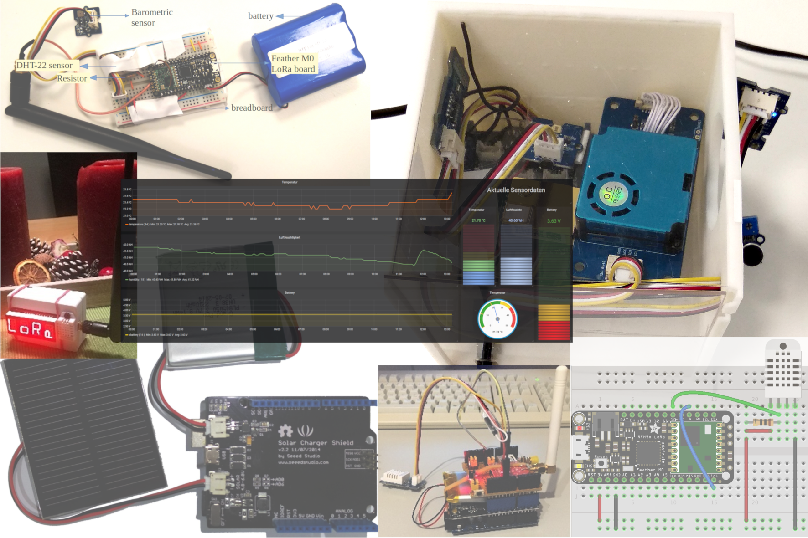

Welcome to the TUM-GIS Sensor Nodes documentation
=================================================

This repo contains documentation, Arduino sketches, and images of our
sensor nodes and the sensor services we used.

Contact and contribution
++++++++++++++++++++++++

We are happy for any kind of comments, questions, corrections,
and own contributions.
Please visit the `Github Repo <https://github.com/tum-gis/sensor-nodes>`_
of this documentation to report a
`correction, bug, or question <https://github.com/tum-gis/sensor-nodes/issues>`_ or
contribute with a
`pull request <https://github.com/tum-gis/sensor-nodes/pulls>`_.

Contents
++++++++

.. toctree::
  :maxdepth: 3
  :name: mastertoc

  solar_powered_seeeduino/README
  indoor_ambient_monitoring_with_seeeduino_loRaWAN/README
  featherm0lora_in_tfa_housing/README
  adafruit_32u4_lora/README
  adafruit_32u4_with_display/README
  adafruit_m0_lora/README
  dragino_lora_arduino_shield/README
  pycom_lopy4/README
  seeeduino_lorawan/README
  seeeduino_lorawan_gps/README
  all_on_one_rpi_node/README
  wemos_ttgo_t-beam/README

Indices and tables
++++++++++++++++++

* :ref:`genindex`
* :ref:`search`

.. * :ref:`modindex`
