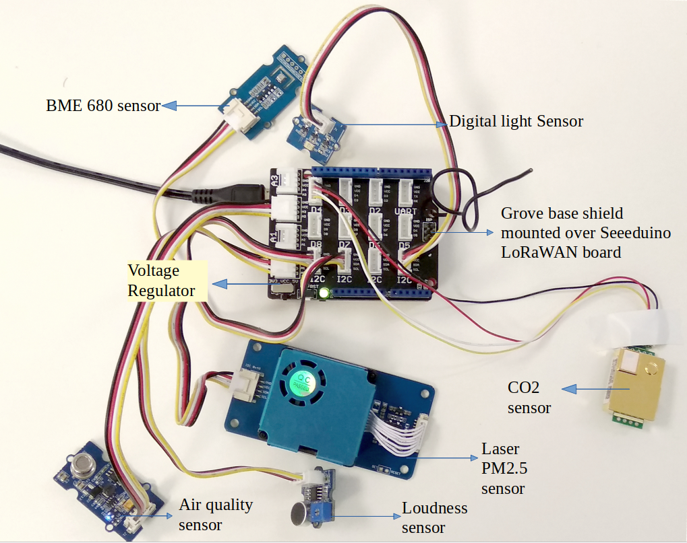

Indoor Ambient Monitoring
=========================

This sensor node is made to showcase a use-case of LoRaWAN for
indoor ambience monitoring. For achieving this a multitude of
sensors were used which can monitor the quality of the ambience.
In this example we measure parameters such as temperature, humidity,
air pressure, air quality, CO2, loudness, gas, PM2.5, and light.

.. figure:: hardware-setup.jpg
  :width: 70 %
  :align: center

  Hardware setup.

Hardware
--------

To realize the objective, following components were used:

- `Seeeduino LoRaWAN board V4.2 <http://wiki.seeedstudio.com/Seeeduino_LoRAWAN/>`_
- `Grove Base Shield Arduino V2 <https://www.seeedstudio.com/Base-Shield-V2.html>`_
- `Grove - Air Quality Sensor <http://wiki.seeedstudio.com/Grove-Air_Quality_Sensor_v1.3/>`_
- `Grove - Loudness Sensor <http://wiki.seeedstudio.com/Grove-Loudness_Sensor/>`_
- `Grove - Digital Light Sensor <http://wiki.seeedstudio.com/Grove-Digital_Light_Sensor/>`_
- `Grove - BME680 Sensor <http://wiki.seeedstudio.com/Grove-Temperature_Humidity_Pressure_Gas_Sensor_BME680/>`_
- `Grove - Laser PM2.5 Sensor (HM3301) <http://wiki.seeedstudio.com/Grove-Laser_PM2.5_Sensor-HM3301/>`_
- `MHZ19B CO2 Sensor <https://www.winsen-sensor.com/d/files/infrared-gas-sensor/mh-z19b-co2-ver1_0.pdf>`_
- Micro USB Charger

Wiring setup
------------

First of all, the grove base shield was connected over the Seeeduino
LoRaWAN board. The board was set at the 5V mode. Then, the sensor
connections were made using the connector cables as following:

- Loudness Sensor – Analog Pin A0
- PM 2.5 Sensor – I2C pin
- Digital Light Sensor – I2C pin
- BME680 Sensor – I2C pin
- MHZ19B CO2 Sensor – Digital Pin D4
- Air Quality Sensor - A2

Apart from this, there is no need of any other wiring in this case.

  Hardware connections.

Once all these connection were made, the board is connected with
a computer using a USB cable. Further, steps of software part
needs to be followed.

Software
--------

To create this node, we use Arduino IDE for setting up the
Seeeduino LoRaWAN device. First, install the `Seeeduino
LoRaWAN board <http://wiki.seeedstudio.com/Seeeduino_LoRAWAN/>`_
board to your Arduino IDE and select the correct port. Then
following libraries needs to be installed before compiling
the code:

- `Digital_Light_TSL2561.h <https://github.com/Seeed-Studio/Grove_Digital_Light_Sensor/archive/master.zip>`_ for Digital Light Sensor
- `Air_Quality_Sensor.h <https://github.com/Seeed-Studio/Grove_Air_quality_Sensor>`_ for Air Quality Sensor
- `Seeed_bme680.h <https://github.com/Seeed-Studio/Seeed_BME680>`_ for BME680 Sensor
- `Seeed_HM330X.h <https://github.com/Seeed-Studio/Seeed_PM2_5_sensor_HM3301>`_ for Laser PM2.5 Sensor
- `MHZ19.h <https://github.com/strange-v/MHZ19>`_ for MHZ19B CO2 Sensor
- `Wire.h <https://github.com/esp8266/Arduino/tree/master/libraries/Wire>`_ to communicate with I2C devices
- `SoftwareSerial.h <https://github.com/PaulStoffregen/SoftwareSerial>`_ for Serial Communication
- `RTCZero.h <https://github.com/arduino-libraries/RTCZero>`_ for controlling internal clock for time
- `CayenneLPP.h <https://github.com/ElectronicCats/CayenneLPP/archive/master.zip>`_ for Cayenne Protocol

Apart from this LoRaWan.h library is also used but it is
bundled within Seeeduino Board and is not required to be
separately installed.

Now download and run the :ref:`Arduino_Sketch_Indoor.ino`
file in the Arduino IDE. This code was created by merging
the example code of each of these attached sensor and the
ttn-otaa example from the Seeeduino board. Some required
changes were made while merging the example codes. For
example, as there are multiple sensors each needs to be
defined with a unique name. So, here HM330X was named as
sensor while AirqualitySensor as sensors.

.. literalinclude:: Arduino_Sketch_Indoor/Arduino_Sketch_Indoor.ino
   :language: arduino
   :linenos:
   :caption: Setup the sensors in :ref:`Arduino_Sketch_Indoor.ino`
   :name: Arduino_Sketch_Indoor.ino_Sensors
   :lines: 16-34

The user should change the network session key, app session
key and device address in the code before compiling. These
keys can be obtained from the TTN, SWM or any other service
providers.

.. literalinclude:: Arduino_Sketch_Indoor/Arduino_Sketch_Indoor.ino
   :language: arduino
   :linenos:
   :caption: Modify the keys in highlighted lines
   :name: Arduino_Sketch_Indoor.ino_Keys
   :lines: 138-146
   :emphasize-lines: 6,9

Services
--------

This node is connected using the TheThingsNetwork service.
Further, a node-red work bench is used to forward this
collected data from the TTN platform to the OGC Sensor
Things API configured on the FROST Server. The node-red
workbench that was used for forwarding the data is available
at :ref:`Node_flow_Indoor.json`. To use this node-red-workbench
go to the node-red platform https://iot.gis.bgu.tum.de:1885/,
login with the credentials, go to the options and select
Import>Clipboard. Select the downloaded .json file with the
given option and click on import. Make necessary changes and
deploy the flow.

Datastreams setup for this sensor node on the FROST server can be seen at:
http://iot.gis.bgu.tum.de:8081/FROST-Server-gi3/v1.0/Things(21)/Datastreams

The node-red workbench for this sensor node could be found at:
https://iot.gis.bgu.tum.de:1885/#flow/7d5c6b14.d2af94

The GRAFANA dash-board for visualizing the collected data is available at:
https://iot.gis.bgu.tum.de:3050/d/jDJ1li1Wz/indoor-ambient-monitoring-with-seeeduino-lorawan-and-sensors?orgId=1

Code files
----------

.. literalinclude:: Arduino_Sketch_Indoor/Arduino_Sketch_Indoor.ino
   :language: arduino
   :linenos:
   :caption: Arduino Sketch for Indoor Ambient Monitoring sensor node
   :name: Arduino_Sketch_Indoor.ino

.. literalinclude:: Node_flow_Indoor.json
   :language: json
   :linenos:
   :caption: Node red flow for Indoor Ambient Monitoring sensor node
   :name: Node_flow_Indoor.json

References
----------

- :ref:`Arduino_Sketch_Indoor.ino`
- :ref:`Node_flow_Indoor.json`
- `Wiki guide for Seeeduino LoRaWAN board <http://wiki.seeedstudio.com/Seeeduino_LoRAWAN/>`_
- `Adding Seeed boards to Arduino IDE <http://wiki.seeedstudio.com/Seeed_Arduino_Boards/>`_
