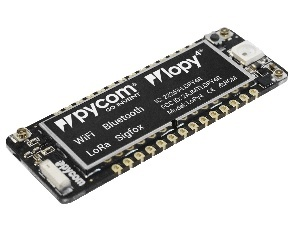
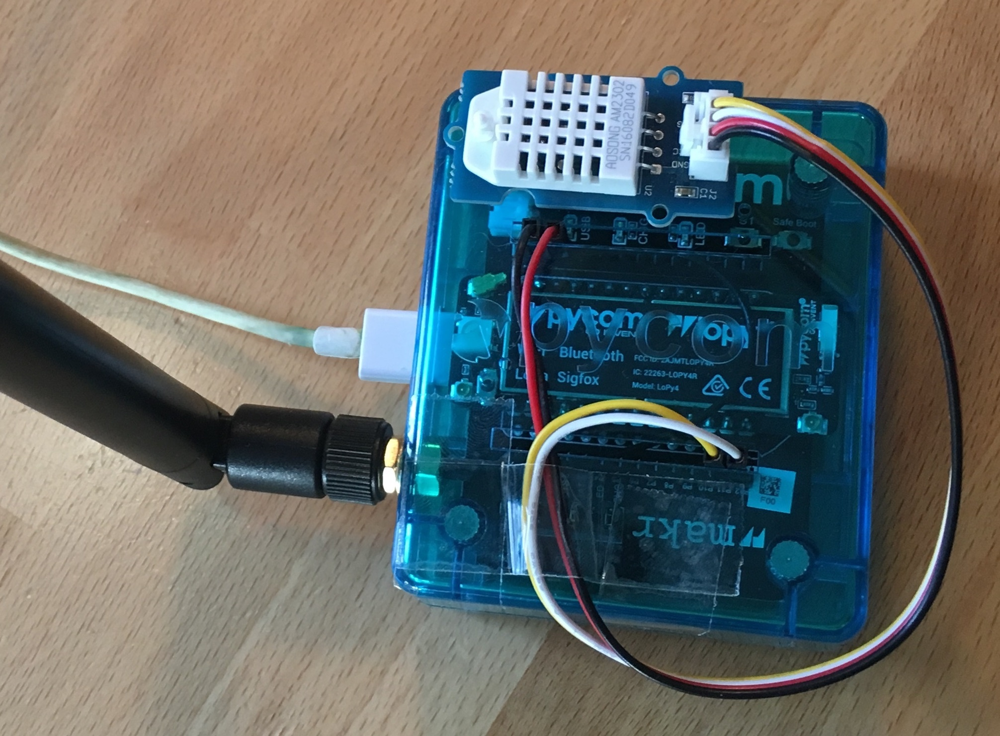
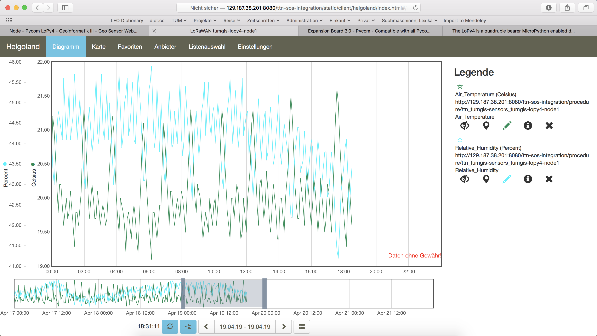

Pycom LoPy4
===========

This tutorial is made to showcase the use of Pycom LoPy4
board to create a LoRaWAN enabled sensor node. In the
following example, a temperature and humidity sensor was
used with the Pycom LoPy4 board.

Hardware
--------

Microcontroller
^^^^^^^^^^^^^^^

  `LoPy4 <https://pycom.io/product/lopy4/>`_ from Pycom.
  `LoPy4 pinout <https://docs.pycom.io/datasheets/development/lopy4/>`_,
  documentation, example code.

The `Pycom LoPy4 <https://pycom.io/product/lopy4/>`_ is a microcontroller board offering many
radio frequency (RF) connection options, namely LoRa (and
LoRaWAN), SIGFOX, Bluetooth (Classic and Low Energy, BLE),
and WiFi. In contrast to most other microcontroller boards
the LoPy4 is programmed in `MicroPython <https://micropython.org/>`_, which is a special
subset of the Python 3 programming language and libraries
for microcontrollers. The module is operated by the `Espressif
ESP32 microcontroller <https://www.espressif.com/en/products/hardware/esp32/overview>`_ board, which contains a dual-core Xtensa
32bit LX6 processor running with up to 240MHz, 8 MB of flash
memory (to store the program code and some files within a
file system), and 520 KB of RAM (to store variables, status
information, and buffers). The ESP32 module also has
built-in WiFi and Bluetooth LE connectivity. In addition,
the LoPy4 has 4 MB of PSRAM (pseudo static RAM) that is
used as a memory extension for the ESP32. The operating
voltage of the board is 3.3V (this is important when
attaching sensors and other peripherals; they also must
operate on 3.3V). The board offers 18 general purpose
input/output pins (18 GPIOs), from which up to 12 can
be used as analog input pins (with 12bit analog digital
converters (ADC)) and two as analog output pins (8bit
digital analog converter (DAC)). Most GPIO pins can be
configured for specific hardware protocols. In total 3
serial ports (programmable Universal Asynchronous Receiver
and Transmitter, UART), 2 I2C ports, 3 SPI ports, 1 CAN
bus, 1 PWM channel, and an I2S port can be utilized. The
board has a built-in RGB LED that can be programmed by
the user. The LoPy4 is available from the manufacturer
for around 35 €.

The LoPy4 needs to be operated on 3.5V – 5.5V put to the
VIN pin. The onboard regulator brings it down to 3.3V.
The 3.3V pin can only be used as an output. Do not feed
3.3V into this pin as this could damage the regulator.
The board can be programmed over the serial interface,
or via WiFi using a telnet or FTP connection. By default,
the LoPy4 acts as a WiFi access point (SSID: lopy4–wlan–XXXX,
Password: www.pycom.io) and a user can connect to the
module after joining the WiFi network in order to upload
user programs and data files.

A WiFi and Bluetooth antenna is mounted on the LoPy
board, but also an external antenna can be connected
via an SMA-type connector. The LoRa or SIGFOX antenna
has to be connected via an SMA-type connector. The LoRa
transmitter and receiver is encapsulated within a LoRa
module. It uses the LoRa chip SX1276 from the company
Semtech and can be configured to work either in the
433 MHz, 868 MHz, or 915 MHz frequency band. The LoRa
module is connected via SPI interface to the microcontroller
and all of the required connections of the LoRa
transceiver pins with the microcontroller are already
built-in on the LoPy4 board. Since the module only
implements the LoRa physical layer, the LoRaWAN protocol
stack is implemented in software on the microcontroller.
The implemented LoRaWAN functionality is compatible
with LoRaWAN Class A/C.

  The Pycom LoPy4 with the `Expansion Board 3 <https://pycom.io/product/expansion-board-3-0/>`_
  (inside the blue case) and an externally
  attached DHT22 temperature and humidity sensor.

Expansion board 3.0
^^^^^^^^^^^^^^^^^^^

The LoPy4 can be attached to the `Pycom Expansion Board 3.0 <https://pycom.io/product/expansion-board-3-0/>`_.
The board offers a USB port that is connected internally
via a USB/Serial converter to the default serial port (UART)
of the LoPy4. This allows to easily upload programs and data
files to the LoPy4 from a developer computer over USB connection.
The expansion board also comes with a connector for a 3.7V
lithium polymer (LiPo) battery with an additional battery
charger circuit. When the expansion board is connected via
USB to a developer computer or to an USB charger, an attached
battery will be automatically charged. The battery voltage
can be monitored via the LoPy4 analog to digital converter
(ADC). The board also comes with a user LED, a user switch,
and a MicroSD card slot to read and write files from the
LoPy4, for example, to log recorded data. The LoPy Epansion
Board 3.0 is available from the manufacturer for 16 €.

Sensor
^^^^^^

We have attached a `Grove DHT22 sensor <http://wiki.seeedstudio.com/Grove-Temperature_and_Humidity_Sensor_Pro/>`_ module to the
expansion board, which measures air temperature and
humidity. The minimal time interval between two measurements
is 2 seconds. All data transfers between the DHT22 and
the microcontroller use a single digital line. The
sensor data pin is attached to a GPIO pin (here: GPIO22)
of the expansion board. The 5V pin of the Grove module
is connected to 3V3 of the expansion board, and the
GND of the Grove module to GND of the expansion board.
The `DHT22 datasheet <https://www.sparkfun.com/datasheets/Sensors/Temperature/DHT22.pdf>`_
can be accessed here. The sensor is available in German
shops for around 4 € to 10 €.

Software
--------

The sensor node has been programmed in the
`MicroPython <https://micropython.org/>`_ language.
We use `Microsoft's Visual Studio Code <https://code.visualstudio.com/>`_
platform with the `Pymakr plugin <https://docs.pycom.io/pymakr/installation/>`_
to edit and upload the program. The Pymakr plugin
is developed by Pycom and can be used with either
Visual Studio Code or the `Atom Text Editor <https://atom.io/>`_.
Both IDEs can be downloaded free of charge; Atom is
also Open Source software. Note that MicroPython
programs do not need to be compiled (like Java or
C/C++ programs). The source code is interpreted by
the Microcontroller instead.

The source code consists of the following two files.
:ref:`main.py` and :ref:`boot.py`. They must be
copied into the base folder on the LoPy4. We use a
library for the DHT22 written by Erik de Lange. It
can be downloaded from `the following link <https://github.com/erikdelange/WiPy-2.0-DHT22>`_
but is also provided here :ref:`dht22.py`. The
library has to be copied into the subdirectory "lib"
on the LoPy4. 

After the program has successfully established a
connection to The Things Network it reports the
air temperature, humidity, and the voltage of an
attached LiPo battery every 5 minutes. Since we
are running the device on an USB charger, the
program does not check the battery level and
the transferred value is always set to 0 V.
All three values are being encoded in two byte
integer values each (in most significant byte
order) and then sent as a 6 bytes data packet
to the respective TTN application using LoRaWAN
port 7. Please note, that LoRaWAN messages can
be addressed to ports 1-255 (port 0 is reserved);
these ports are similar to port numbers 0-65535
when using the Internet TCP/IP protocol. Voltage
and humidity values are always greater or equal
to 0, but the temperature value can also become
negative. Negative values are represented as a
`two's complement <https://en.wikipedia.org/wiki/Two%27s_complement>`_ ;
this must be considered in the Payload Decoding
Function used in The Things Network (see
`below <#ttn-payload-decoding>`_).

The program as given above does not make use of
the deep sleep mode or any other power saving
method. In between two sensor readings the
microcontroller is busy 'doing nothing' until the
waiting time before the next measurement is over.
When the LoPy4 should be operated on battery, the
`power saving modes <https://docs.pycom.io/firmwareapi/pycom/machine/#machinedeepsleeptimems>`_
of the LoPy4 should be investigated. Note that
this will require to restructure the :ref:`main.py`
program significantly.

Services
--------

The services used for this sensor-node are:

- `TheThingsNetwork <#registration-of-the-sensor-node-with-the-things-network-ttn>`_ service for LoRaWAN network service.
- `TheThingsNetwork - OGC SensorWeb <#the-things-network-ogc-sensorweb-integration>`_ integration for uploading LoRaWAN sensor data into OGC infrastructure.

Registration of the sensor node with The Things Network (TTN)
^^^^^^^^^^^^^^^^^^^^^^^^^^^^^^^^^^^^^^^^^^^^^^^^^^^^^^^^^^^^^

The LoRaWAN protocol makes use of a number of different
identifiers, addresses, keys, etc. These are required
to unambiguously identify devices, applications, as
well as to encrypt and decrypt messages. The names
and meanings are nicely explained on a `dedicated TTN
web page <https://www.thethingsnetwork.org/docs/lorawan/address-space.html>`_.

The program given above connects the sensor node
with The Things Network (TTN) using the Over-the-Air-Activation
(OTAA) mode. In this mode, we use the three keys AppEUI,
DevEUI, AppKey. The DevEUI is pre-programmed into the
LoPy4. In order to register the device with TTN, you
first need to fetch the DevEUI from the LoPy4 board.
This is `explained in the LoPy4 documentation <https://docs.pycom.io/gettingstarted/registration/lora/ttn.html#register-a-device>`_. Each
sensor node must be manually registered in the `TTN
console <https://console.thethingsnetwork.org>`_ before
it can be started. This assumes that you already
have a TTN user account and have created an application
in the user account (both need to be created otherwise).
`In the TTN console create a new device <https://www.thethingsnetwork.org/docs/devices/registration.html>`_
using the DevEUI value that was previously determined. After
the registration of the device the two generated keys
(AppEUI, AppKey) can be copied from the TTN console
and must be pasted into the the proper places in the
source code of the program above. Please make sure
that you choose for both keys the correct byte ordering
(all are in MSB, i.e. in the same ordering as given
in the TTN console). A detailed explanation of these
steps is given `here <https://docs.pycom.io/gettingstarted/registration/lora/ttn.html>`_.
Then the program can be uploaded to the LoPy4 microcontroller.
Note that the two constants (AppEUI, AppKey) must be
changed in the source code for every new sensor node
(the DevEUI is different for each node anyway).

Using the OTAA mode has the advantage over the ABP
(activation by personalization) mode that during
connection the session keys are newly created which
improves security. Another advantage is that the packet
counter is automatically reset to 0 both in the node
and in the TTN application.

TTN Payload Decoding
^^^^^^^^^^^^^^^^^^^^

Everytime a data packet is received by a TTN application
a dedicated Javascript function is being called (Payload
Decoder Function). This function can be used to decode
the received byte string and to create proper Javascript
objects or values that can directly be read by humans when
looking at the incoming data packet. This is also useful
to format the data in a specific way that can then be
forwarded to an external application (e.g. a sensor data platform like `MyDevices
<https://mydevices.com/>`_ or `Thingspeak <https://thingspeak.com/>`_ ).
Such a forwarding can be configured in the TTN console in the
"Integrations" tab. :ref:`TTN_Payload_Decoder_LoPy4` given here checks if a
packet was received on LoRaWAN port 7 and then assumes
that it consists of the 6 bytes encoded as described above.
It creates the three Javascript objects 'temperature',
'humidity', and 'vbattery'. Each object has two fields:
'value' holds the value and 'uom' gives the unit of measure.
The source code can simply be copied and pasted into the
'decoder' tab in the TTN console after having selected
the application. Choose the option 'Custom' in the
'Payload Format' field. Note that when you also want
to handle other sensor nodes sending packets on different
LoRaWAN ports, then the Payload Decoder Function can be
extended after the end of the  if (port==7) {...} statement
by adding  else if (port==8) {...} else if (port==9) {...} etc.

The Things Network - OGC SensorWeb Integration
^^^^^^^^^^^^^^^^^^^^^^^^^^^^^^^^^^^^^^^^^^^^^^

The presented Payload Decoder Function works also with the
TTN-OGC SWE Integration for the `52° North Sensor Observation
Service (SOS) <https://github.com/52North/SOS>`_. This software
component can be downloaded from this `repository <https://github.com/52North/ttn-ogcswe-integration>`_.
It connects a TTN application with a running transactional
`Sensor Observation Service 2.0.0 (SOS) <https://www.opengeospatial.org/standards/sos>`_. Data packets received
from TTN are imported into the SOS. The SOS persistently stores
sensor data from an arbitrary number of sensor nodes and can
be queried for the most recent as well as for historic sensor
data readings. The 52° North SOS comes with its own REST API
and a nice web client allowing to browse the stored sensor
data in a convenient way.

We are running an instance of the 52° North SOS and the
TTN-OGC SWE Integration. The web client for this LoRaWAN
sensor node can be accessed `on this page <http://129.187.38.201:8080/ttn-sos-integration/static/client/helgoland/index.html#/diagram?ts=ttnOGC__32,ttnOGC__31>`_.
Here is a screenshot showing the webclient:

  Web client for data visualization

Code files
----------

.. literalinclude:: LoPy4-DHT22-TTN/boot.py
   :language: python
   :linenos:
   :caption: boot.py
   :name: boot.py

.. literalinclude:: LoPy4-DHT22-TTN/main.py
   :language: python
   :linenos:
   :caption: main.py
   :name: main.py

.. literalinclude:: LoPy4-DHT22-TTN/lib/dht22.py
   :language: python
   :linenos:
   :caption: dht22.py
   :name: dht22.py

.. literalinclude:: TTN_Payload_Decode.js
   :language: Javascript
   :linenos:
   :caption: TTN payload decoder
   :name: TTN_Payload_Decoder_LoPy4

References
----------

- `Pycom LoPy4 product homepage <https://pycom.io/product/lopy4/>`_
- `LoPy4 specification document <https://docs.pycom.io/.gitbook/assets/specsheets/Pycom_002_Specsheets_LoPy4_v2.pdf>`_
- `LoPy4 pinout specification <https://docs.pycom.io/.gitbook/assets/lopy4-pinout.pdf>`_
- `LoPy4 online documentation (incl. description of software libraries) <https://docs.pycom.io>`_
- `MicroPython language and library reference <https://micropython.org>`_
- `LoPy4 Getting Started (hardware & software setup, installation of Pymakr IDE) <https://docs.pycom.io/gettingstarted/introduction.html>`_

**On the Expansion Board 3.0**

- `Pycom Expansion Board 3.0 product homepage <https://pycom.io/product/expansion-board-3-0/>`_
- `Expansion Board 3.0 documentation (pinout, datasheet) <https://docs.pycom.io/datasheets/boards/expansion3>`_

**On the DHT22 sensor**

- `MicroPython library for the DHT22 sensor <https://github.com/erikdelange/WiPy-2.0-DHT22>`_
- `DHT22 datasheet <https://www.sparkfun.com/datasheets/Sensors/Temperature/DHT22.pdf>`_
