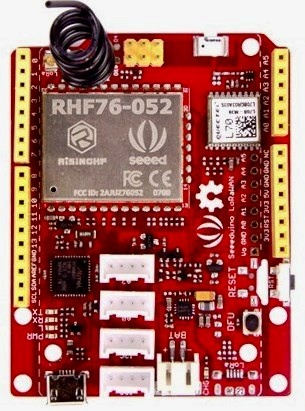
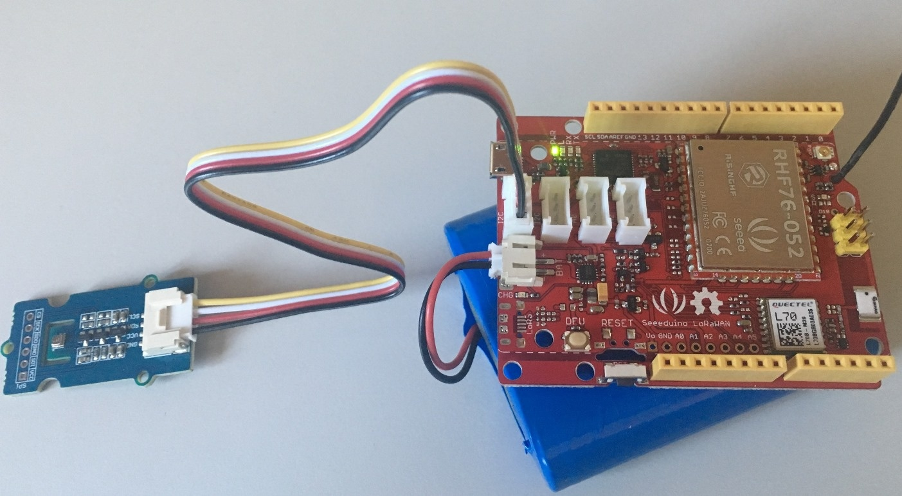
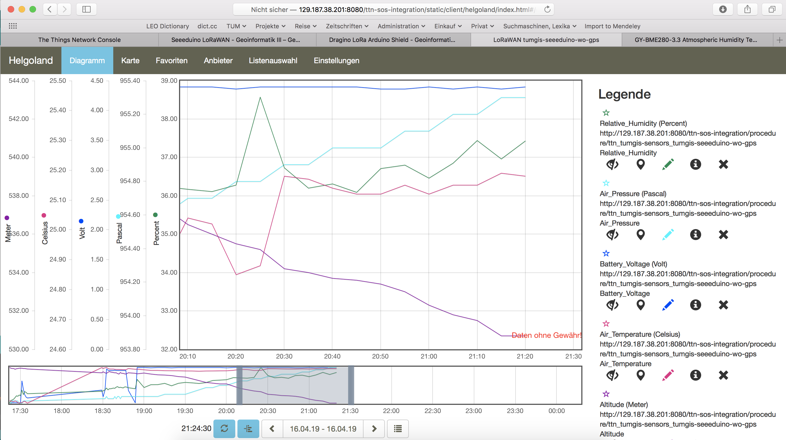

Seeeduino LoRaWAN with GPS
==========================

Hardware
--------

Micro-controller
^^^^^^^^^^^^^^^^

  
  `Seeeduino LoRaWAN GPS microcontroller <http://wiki.seeedstudio.com/Seeeduino_LoRAWAN/>`_ 
  from Seeed Studio. 
  
The Seeeduino LoRaWAN module is operated by the 32bit 
microcontroller ATSAMD21G18 (ARM® Cortex®-M0+) running 
at 48MHz. It has 256 KB flash memory (to store the program 
code) and 32 KB of RAM (to store variables, status 
information, and buffers). The operating voltage of the 
board is 3.3V (this is important when attaching sensors 
and other peripherals; they also must operate on 3.3V). 
The board offers 20 general purpose digital input/output 
pins (20 GPIOs), 6 analog input pins (with 12bit analog 
digital converters (ADC)), 1 analog output pin (with 10bit 
digital analog converter (DAC)), 2 serial ports (2 programmable 
Universal Asynchronous Receiver and Transmitters, UARTs). 
The board comes with an embedded lithium battery management 
chip and status indicator led, which allows to directly 
connect a 3.7V LiPo rechargeable battery that will be 
automatically recharged when the board is powered over 
its USB connector. The battery voltage level can be queried 
from analog input A4, the charging status (charging, full) 
from analog input A5. There is an on-board `L70 GPS receiver 
module from the company Quectel Wireless Solutions <https://github.com/SeeedDocument/Seeeduino_LoRa/blob/master/res/L70B-M39.pdf>`_ 
and a small chip antenna. The Seeeduino LoRaWAN GPS module 
is available in German shops from around 37 € to 45 €.

The LoRa transmitter and receiver is encapsulated within 
an RHF76-052AM module from the Chinese company RisingHF. 
The RF module contains its own microcontroller, which 
implements the LoRaWAN protocol. The module is connected 
via the serial interface to the ATSAMD21G18 microcontroller 
and can be controlled by sending so-called 'AT' commands. 
The implemented LoRaWAN functionality is compatible with 
LoRaWAN Class A/C. The explanation of all supported commands 
as well as a number of examples on how to use the Seeeduino 
LoRaWAN are given on the `Seeeduino LoRaWAN Wiki <http://wiki.seeedstudio.com/Seeeduino_LoRAWAN/>`_.

The board has 4 on-board Grove connectors. 'Grove' is a 
`framework developed by the company Seeed Studio <http://wiki.seeedstudio.com/Grove_System/>`_ 
standardizing the connectors, operating voltages, and pin 
configurations for attaching peripherals like `sensors, actuators, and displays <http://wiki.seeedstudio.com/Grove/>`_ 
to microcontrollers. The board has also the typical 
`Arduino UNO connectors <http://marcusjenkins.com/arduino-pinout-diagrams/>`_ 
allowing to attach so-called `Arduino shields <https://learn.sparkfun.com/tutorials/arduino-shields>`_ 
(however, please note that the shields must be working with 
3.3V; the normal operating voltage for the Arduino UNO 
microcontroller and its shields is 5V).

  
  The Seeeduino LoRaWAN GPS microcontroller with a 6600 
  mAh lithium polymer (LiPo) battery (bottom), and an 
  attached `BME280 temperature / humidity / barometer 
  sensor module <https://www.kuongshun-ks.com/uno/uno-sensor/gy-bme280-3-3-precision-altimeter.html>`_.

Sensor
^^^^^^

We attached a `Seeed BME280 Grove module <http://wiki.seeedstudio.com/Grove-Barometer_Sensor-BME280/>`_ 
with a `Bosch BME280 sensor <https://www.bosch-sensortec.com/bst/products/all_products/bme280>`_ 
to the first I2C Grove connector of the Seeeduino LoRaWAN 
board. The BME280 measures temperature in the range 
-40 - 85 ℃, with ±1.0°C accuracy; 0%-100% relative 
humidity with ±3% accuracy; and atmospheric pressure 
in the range 300 - 1100 hPa (1 hPa= one hundred Pa) 
with ±1.0 hPa accuracy. It offers the two interface 
standards I2C and SPI (we are using I2C here and the 
default I2C address 0x76). The atmospheric pressure 
changes with altitude, hence, the BME280 can also be 
used to measure the approximate altitude of a place.

Software
--------

The sensor node has been programmed using the `Arduino 
IDE <https://www.arduino.cc/en/main/software>`_. Please 
note, that in the Arduino framework a program is called 
a 'Sketch'. 

In order to support the "Seeeduino LoRaWAN" board with 
the Arduino IDE, make sure to have installed the package 
"Seeed SAMD boards by Seeed Studio" in version 1.3.0 using 
the `board manager <https://www.arduino.cc/en/guide/cores>`_ in the Arduino IDE. This is also explained 
on a `dedicated webpage <http://wiki.seeedstudio.com/Seeed_Arduino_Boards/>`_ from Seeed Studio. The sketch requires 
the software libraries "RTCZero", "Arduino_BME280", 
"Adafruit_Sensor", "Wire", and "LoRaWAN". The first three 
have to be installed using the `library manager <https://www.arduino.cc/en/Guide/Libraries>`_ 
of the Arduino 
IDE, the fourth library is already installed with the Arduino 
IDE and the latter library comes with the "Seeeduino LoRaWAN" 
board installation.

After the sketch has successfully established a connection 
to The Things Network it measures the air temperature, humidity, 
and pressure every 30 seconds. From the measured values also 
the altitude of the device (in meters above ground) is estimated. 
All four values are being encoded in two byte integer values 
each and then sent as an 8 bytes data packet to the respective 
TTN application using LoRaWAN port 8. Please note, that LoRaWAN 
messages can be addressed to ports 1-255 (port 0 is reserved); 
these ports are similar to port numbers 0-65535 when using the 
Internet TCP/IP protocol.  Voltage, pressure, altitude, and 
humidity values are always greater or equal to 0, but the 
temperature value can also become negative. Negative values 
are represented as a `two's complement <https://en.wikipedia.org/wiki/Two%27s_complement>`_; 
this must be considered in the Payload Decoding Function 
used in The Things Network (see below).

In between two sensor readings the microcontroller, the 
LoRaWAN module, and the sensor module are going into deep 
sleep mode to save battery power. During LoRaWAN data 
transmission the device draws up to 65mA current. When in 
sleep mode the entire node only draws around 0.06 mA power. 
Hence, with a 6600 mAh 3.7V LiPo battery and the current 
version of the sketch the system should be able to run for 
many years before recharging (not taking into account the 
self-discharging rate of the battery).

The source code is provided in the following section 
:ref:`Arduino_Sketch_seeeduino_lorawan_gps.ino`

Services
--------

The services used for this sensor-node are: 

- `TheThingsNetwork <#registration-of-the-sensor-node-with-the-things-network-ttn>`_ service for LoRaWAN network service.
- `TheThingsNetwork - OGC SensorWeb <#the-things-network-ogc-sensorweb-integration>`_ integration for uploading LoRaWAN sensor data into OGC infrastructure.

Registration of the sensor node with The Things Network (TTN)
^^^^^^^^^^^^^^^^^^^^^^^^^^^^^^^^^^^^^^^^^^^^^^^^^^^^^^^^^^^^^

The LoRaWAN protocol makes use of a number of different identifiers, 
addresses, keys, etc. These are required to unambiguously identify 
devices, applications, as well as to encrypt and decrypt messages. 
The names and meanings are  nicely explained on a dedicated `TTN web 
page <https://www.thethingsnetwork.org/docs/lorawan/address-space.html>`_.

The sketch given above connects the sensor node with The Things 
Network (TTN) using the Over-the-Air-Activation (OTAA) mode. 
In this mode, we use the three keys AppEUI, DevEUI, AppKey. 
The DevEUI should normally be delivered with the sensor node 
by the manufacturer. However, it seems that there is no explicit 
DevEUI provided with the Seeeduino LoRaWAN module. Therefore, it 
has to be generated automatically together with the other two keys 
using the TTN console. Each sensor node must be manually registered 
in the `TTN console <https://console.thethingsnetwork.org>`_ before 
it can be started. This assumes that you already have a TTN user 
account (which needs to be created otherwise). In the TTN console 
`create a new device <https://www.thethingsnetwork.org/docs/devices/registration.html>`_ 
with also the DevEUI being automatically generated. After the 
registration of the device the respective keys (AppEUI, DevEUI, 
AppKey) can be copied from the TTN console and must be pasted into 
the the proper places in the source code of the sketch above. 
Please make sure that you choose for each of the three keys are 
in the correct byte ordering (all are in MSB, i.e. in 
the same ordering as given in the TTN console). A detailed 
explanation of these steps is given `on this page <https://learn.adafruit.com/the-things-network-for-feather?view=all>`_. 
Then the sketch can be compiled and uploaded to the Seeeduino 
LoRaWAN microcontroller. Note that the three constants (AppEUI, 
DevEUI, AppKey) must be changed in the source code for every 
new sensor node.

Using the OTAA mode has the advantage over the ABP 
(activation by personalization) mode that during connection 
the session keys are newly created which improves security. 
Another advantage is that the packet counter is automatically 
reset to 0 both in the node and in the TTN application. 

TTN Payload Decoding
^^^^^^^^^^^^^^^^^^^^

Everytime a data packet is received by a TTN application a 
dedicated Javascript function is being called (Payload Decoder 
Function). This function can be used to decode the received 
byte string and to create proper Javascript objects or values 
that can directly be read by humans when looking at the incoming 
data packet. This is also useful to format the data in a 
specific way that can then be forwarded to an external 
application (e.g. a sensor data platform like `MyDevices 
<https://mydevices.com/>`_ or `Thingspeak <https://thingspeak.com/>`_ ). 

Such a forwarding can be configured in the TTN console in 
the "Integrations" tab. :ref:`TTN_Payload_Decoder_Seeeduino_lorawan_GPS` 
given here checks if a packet was received on LoRaWAN port 
33 and then assumes that it consists of the 10 bytes encoded 
as described above. It creates the five Javascript objects 
'temperature', 'humidity', 'pressure', 'altitude', and 
'vbattery'. Each object has two fields: 'value' holds 
the value and 'uom' gives the unit of measure. The source 
code can simply be copied and pasted into the 'decoder' 
tab in the TTN console after having selected the application. 
Choose the option 'Custom' in the 'Payload Format' field. 
Note that when you also want to handle other sensor nodes 
sending packets on different LoRaWAN ports, then the Payload 
Decoder Function can be extended after the end of the  if 
(port==33)  {...} statement by adding   else if (port==7) 
{...} else if (port==8) {...} etc. 

The Things Network - OGC SensorWeb Integration
^^^^^^^^^^^^^^^^^^^^^^^^^^^^^^^^^^^^^^^^^^^^^^

The presented Payload Decoder Function works also with the 
TTN-OGC SWE Integration for the `52° North Sensor Observation 
Service (SOS) <https://github.com/52North/SOS>`_. This software 
component can be downloaded from this `repository <https://github.com/52North/ttn-ogcswe-integration>`_. 
It connects a TTN application with a running transactional 
`Sensor Observation Service 2.0.0 (SOS) <https://www.opengeospatial.org/standards/sos>`_. Data packets received 
from TTN are imported into the SOS. The SOS persistently stores 
sensor data from an arbitrary number of sensor nodes and can 
be queried for the most recent as well as for historic sensor 
data readings. The 52° North SOS comes with its own REST API 
and a nice web client allowing to browse the stored sensor 
data in a convenient way.

We are running an instance of the 52° North SOS and the TTN-OGC 
SWE Integration. The web client for this LoRaWAN sensor node can 
be accessed `on this webpage <http://129.187.38.201:8080/ttn-sos-integration/static/client/helgoland/index.html#/diagram?ts=ttnOGC__3,ttnOGC__4,ttnOGC__1,ttnOGC__2,ttnOGC__5>`_. 
Here is a screenshot showing the webclient: 

  Web client for data visualization

Code files
----------

.. literalinclude:: Arduino_Sketch_seeeduino_lorawan_gps/Arduino_Sketch_seeeduino_lorawan_gps.ino
   :language: arduino
   :linenos:
   :caption: Arduino Sketch for Seeeduino LoRaWAN with GPS sensor node
   :name: Arduino_Sketch_seeeduino_lorawan_gps.ino

.. literalinclude:: TTN_Payload_Decode.js
   :language: Javascript
   :linenos:
   :caption: TTN payload decoder for Seeeduino LoRaWAN with GPS sensor node
   :name: TTN_Payload_Decoder_Seeeduino_lorawan_GPS
 
References
----------

- `Seeeduino LoRaWAN GPS <https://www.seeedstudio.com/Seeeduino-LoRaWAN-W-GPS-p-2781.html>`_ microcontroller 
- `Seeeduino LoRaWAN Wiki with instructions <http://wiki.seeedstudio.com/Seeeduino_LoRAWAN/>`_
- `A short presentation on LoRaWAN basics and using the Seeeduino LoRaWAN board <https://www.slideshare.net/MicheleLaMalvaMoreno/seeeduino-lorawan>`_
- `L70 GPS receiver module <https://www.quectel.com/product/l70.htm>`_ from the company Quectel Wireless Solutions 
- `Adafruit GPS library (can be used with the L70 GPS module) <https://github.com/adafruit/Adafruit_GPS>`_

**On battery saving / using the deep sleep mode**

- `Adafruit Feather 32u4 LoRa - long transmission time after deep sleep - End Devices (Nodes) - The Things Network <https://www.thethingsnetwork.org/forum/t/adafruit-feather-32u4-lora-long-transmission-time-after-deep-sleep/11678/7 and https://www.thethingsnetwork.org/forum/t/adafruit-feather-32u4-lora-long-transmission-time-after-deep-sleep/11678/13>`_
- `Full Arduino Mini LoraWAN and 1.3uA Sleep Mode - End Devices (Nodes) - The Things Network <https://www.thethingsnetwork.org/forum/t/full-arduino-mini-lorawan-below-1ua-sleep-mode/8059/97>`_
- `Adding Method to Adjust hal_ticks Upon Waking Up from Sleep · Issue #109 · matthijskooijman/arduino-lmic <https://github.com/matthijskooijman/arduino-lmic/issues/109>`_
- `minilora-test/minilora-test.ino at cbe686826bd84fac8381de47b5f5b02dd47c2ca0 · tkerby/minilora-test <https://github.com/tkerby/minilora-test/blob/cbe686826bd84fac8381de47b5f5b02dd47c2ca0/minilora-test/minilora-test.ino#L190>`_
- `Arduino-LMIC library with low power mode - Mario Zwiers <https://mariozwiers.de/2018/04/04/arduino-lmic-library-with-low-power-mode/>`_