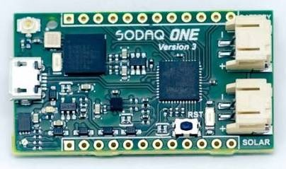
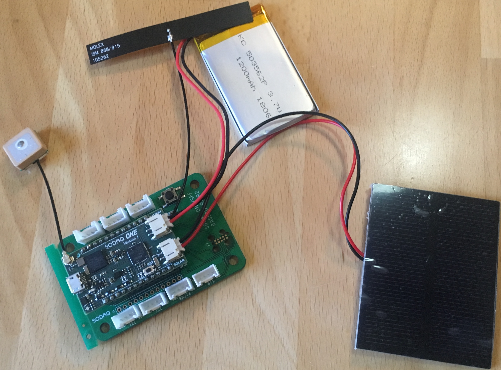

Sodaq ONE
=========

Hardware
--------

Micro-controller
^^^^^^^^^^^^^^^^

  
  `SODAQ ONE-EU-RN2483-V3 <https://shop.sodaq.com/sodaq-one-eu-rn2483-v3.html>`_ 
  from SODAQ. `SODAQ ONE tutorial <https://support.sodaq.com/sodaq-one/sodaq-one/>`_ 
  with explanations, schematics, datasheets, and examples. `SODAQ ONE module pinout 
  <http://support.sodaq.com/wp-content/uploads/2018/05/onev3-pins.png>`_
  
The `SODAQ ONE-EU-RN2483-V3 <https://shop.sodaq.com/sodaq-one-eu-rn2483-v3.html>`_ 
is a very compact module operated by the 32bit 
ATSAMD21G18 microcontroller running at 48 MHz. It 
has 256 KB flash memory (to store the program code) 
and 32 KB of RAM (to store variables, status information, 
and buffers), and up to 16 KB of emulated EEPROM (to 
store configuration data). The operating voltage of 
the board is 3.3V (this is important when attaching 
sensors and other peripherals; they also must operate 
on 3.3V). The board offers 14 general purpose analog/digital 
input/output pins (14 GPIOs) all of which can also 
be used for PWM output, and one of which can be 
used as an analog output pin (with 10bit digital 
analog converter (DAC)). The microcontroller has 
three serial ports (programmable Universal Asynchronous 
Receiver and Transmitter, UART); the first is 
connected internally via a USB/Serial converter 
to the USB port of the board, the second is connected 
internally to the LoRaWAN module, and the third 
is freely usable using GPIO pins D12 (TX) and D13 
(RX). Furthermore, the board has one I2C port and 
four of the GPIO lines can be used as SPI port. 
The SODAQ ONE comes with an embedded Lithium polymer 
battery management chip and status indicator led, 
which allows to directly connect a 3.7V LiPo 
rechargeable battery that will be automatically 
recharged when the board is powered over its USB 
connector. Above, a solar charge controller is 
embedded allowing to directly connect a photovoltaic 
panel (4.5V to 6V) to recharge the battery. The 
board also features an RGB LED, a LSM303AGR module 
(3 axis magnetometer and 3 axis accelerometer), 
and an uBlox EVA 8M GPS module. The SODAQ ONE board 
is available from the manufacturer in Rotterdam, 
The Netherlands, for around 100 €.

The LoRa transmitter and receiver is encapsulated 
within a `Microchip RN2483 <https://www.microchip.com/wwwproducts/en/RN2483>`_ 
LoRaWAN module. It uses the LoRa chip SX1276 from 
the company Semtech and is dedicated to the 868 MHz 
frequency band. The RF module contains its own 
microcontroller, which implements the LoRaWAN protocol. 
The module is connected via the serial interface to 
the ATSAMD21G18 microcontroller and can be controlled 
by sending text commands. The implemented LoRaWAN 
functionality is compatible with LoRaWAN Class A. 
The detailed explanation of the module is given in 
the `RN2483 datasheet <http://ww1.microchip.com/downloads/en/DeviceDoc/50002346C.pdf>`_ and all supported commands in 
the `RN2483 Command Reference <http://ww1.microchip.com/downloads/en/DeviceDoc/40001784F.pdf>`_.

The SODAQ ONE is installed on a `ONE Base board <https://shop.sodaq.com/sodaq-one-base.html>`_
offering 7 on-board Grove connectors. 'Grove' `is 
a framework developed by the company Seeed Studio <http://wiki.seeedstudio.com/Grove_System/>`_ 
standardizing the connectors, operating voltages, 
and pin configurations for attaching peripherals 
like `sensors, actuators, and displays <http://wiki.seeedstudio.com/Grove/>`_ 
to microcontrollers. Please note that grove modules 
to be used with the SODAQ ONE must be working with 
3.3V (the normal operating voltage for the Arduino 
UNO microcontroller and its shields is 5V).

  The SODAQ ONE-EU-RN2483-V3 installed on a `ONE Base <https://shop.sodaq.com/sodaq-one-base.html>`_ 
  board with attached GPS antenna (left), LoRa patch antenna (top), 
  a 1200 mAh lithium polymer (LiPo) battery (top), and an 
  attached 0.5W photovoltaic panel.

Sensor
^^^^^^

The embedded `LSM303AGR <https://www.st.com/en/mems-and-sensors/lsm303agr.html>`_ 
is an ultra-low-power 3D electronic compass featuring 
linear acceleration full scales of ±2g/±4g/±8g/±16g 
and a magnetic field dynamic range of ±50 gauss. 
The module can be configured to generate an interrupt 
signal for free-fall, motion detection and magnetic 
field detection. It is connected to the microcontroller 
via I2C bus. When the SODAQ ONE is used to track 
moving objects (like bikes, people, or animals), 
the LSM303AGR sensor can be used to wake up the 
microcontroller and the GPS from power saving mode 
(deep sleep). This way, the power consumption of 
the SODAQ ONE can be minimized (only when a movement 
has been detected, a new GPS position fix has to be 
acquired). The detailed explanation of the module 
is given in the `LSM303AGR datasheet <https://www.st.com/resource/en/datasheet/lsm303agr.pdf>`_.

The embedded `uBlox EVA 8M GPS <https://www.u-blox.com/en/product/eva-8m-sip>`_ 
module is a standard precision GNSS receiver with 72 
channels supporting GPS and GLONASS. The module is 
capable to report up to 18 positions per second (18 Hz). 
It is connected to the microcontroller via I2C bus and 
supports different power saving modes. A detailed 
explanation of the module is given in the 
`uBlox EVA 8M datasheet <https://www.u-blox.com/sites/default/files/EVA-8M_DataSheet_%28UBX-16009928%29.pdf>`_.

Software
--------

The section is still to be written.

Services
--------

The section is still to be written.

Code files
----------

.. literalinclude:: Arduino_Sketch_sodaq_one/Arduino_Sketch_sodaq_one.ino
   :language: arduino
   :linenos:
   :caption: Arduino Sketch for Sodaq ONE sensor node
   :name: Arduino_Sketch_sodaq_one.ino

.. literalinclude:: TTN_Payload_Decode.js
   :language: Javascript
   :linenos:
   :caption: TTN payload decoder for Sodaq ONE sensor node
   :name: TTN_Payload_Decoder_Seeeduino_sodaq
 
References
----------

- `SODAQ ONE-EU-RN2483-V3 microcontroller board <https://shop.sodaq.com/sodaq-one-eu-rn2483-v3.html>`_
- `SODAQ ONE tutorial, schematics, libraries, examples <https://support.sodaq.com/sodaq-one/sodaq-one/>`_
- `SODAQ ONE Base board <https://shop.sodaq.com/sodaq-one-base.html>`_
- `SODAQ main github page <https://github.com/SodaqMoja?tab=repositories>`_
- `Microchip RN2483 LoRaWAN module datasheet <http://ww1.microchip.com/downloads/en/DeviceDoc/50002346C.pdf>`_
- `Microchip RN2483 LoRaWAN module command reference <http://ww1.microchip.com/downloads/en/DeviceDoc/40001784F.pdf>`_
- `SODAQ RN2483 library <https://github.com/SodaqMoja/Sodaq_RN2483>`_
- `RN2483 Firmware Updater <https://github.com/SodaqMoja/RN2483FirmwareUpdater>`_
- `LSM303AGR module datasheet <https://www.st.com/resource/en/datasheet/lsm303agr.pdf>`_
- `SODAQ LSM303AGR library <https://github.com/SodaqMoja/Sodaq_LSM303AGR>`_
- `uBlox EVA 8M GPS module <https://www.u-blox.com/sites/default/files/EVA-8M_DataSheet_%28UBX-16009928%29.pdf>`_
- `SODAQ uBlox GPS library <https://github.com/SodaqMoja/Sodaq_UBlox_GPS>`_
- `SODAQ Universal Tracker <https://github.com/SodaqMoja/Sodaq_Universal_Tracker>`_
- `SODAQ ONE Tracker v3 <https://github.com/SodaqMoja/SodaqOne-UniversalTracker-v3>`_