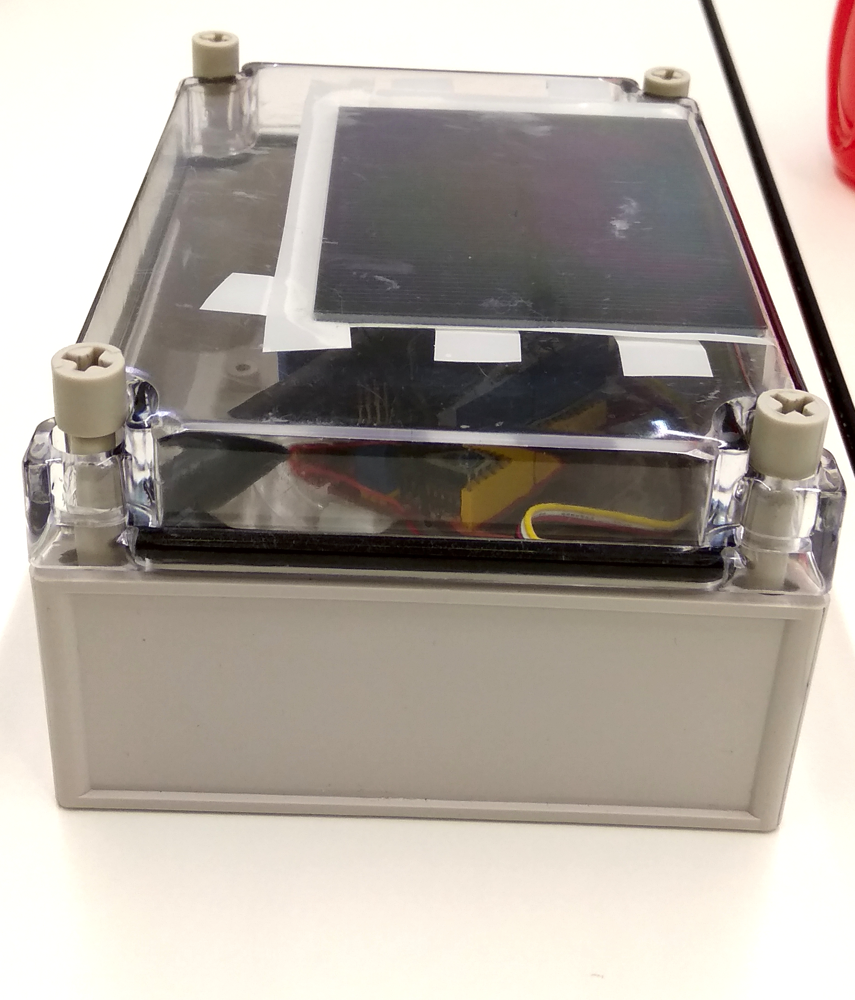
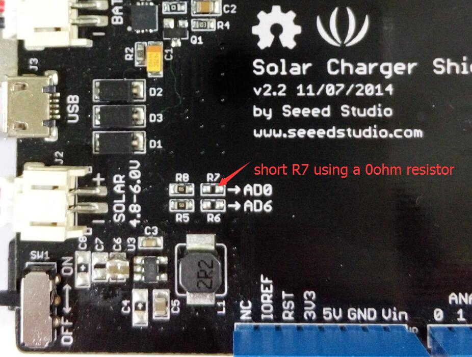
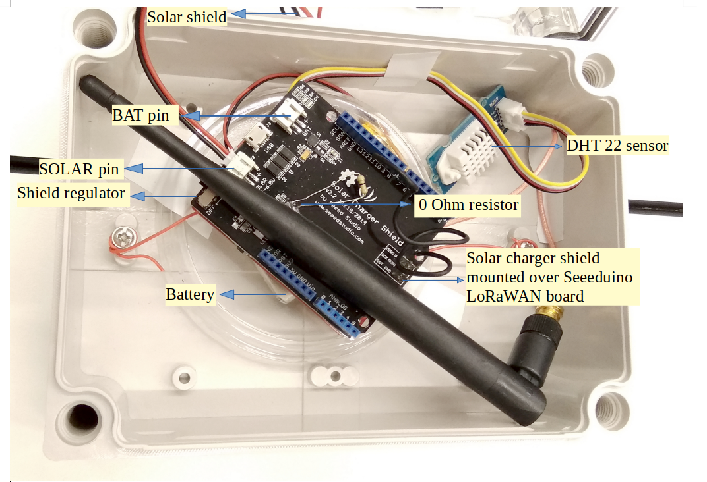

Solar powered Seeeduino
=======================

This sensor node is made to showcase a use-case of LoRaWAN sensor node
powered using a solar panel. For achieving this a Seeeduino LoRaWAN
microcontroller was used along with a solar panel connected using
a solar shield. To show a generic use-case we have used a temperature
and humidity sensor in this case, but it can be easily replaced with
some other sensor as well. The entire setup was carefully placed in
the `ABS Waterproof case <https://www.aliexpress.com/item/32806344313.html>`_
which is an easy to install water-proof and dust-proof case for an indoor or
outdoor sensor installations. However, this case has no provision for the
ventilation unlike the
`TFA case <https://www.tfa-dostmann.de/en/produkt/protective-cover-for-outdoor-transmitter/>`_
and so the readings obtained by the sensor may not accurately represent
the outdoor weather conditions. In this example, we measure parameters
such as temperature, humidity, and battery voltage.

  Sensor node in ABS Waterproof case.

Hardware
--------

To build this sensor node we have used following hardware components:

- `Seeeduino LoRaWAN board V4.2 <http://wiki.seeedstudio.com/Seeeduino_LoRAWAN/>`_
- `Grove - DHT-22 Temperature & Humidity Sensor <http://wiki.seeedstudio.com/Grove-Temperature_and_Humidity_Sensor_Pro/>`_
- `Solar charger shield <http://wiki.seeedstudio.com/Solar_Charger_Shield_V2.2/>`_
- `1.5 W Solar panel <https://www.seeedstudio.com/1-5W-Solar-Panel-81X137.html>`_
- `0 ohm resistor <http://www.learningaboutelectronics.com/Articles/Zero-ohm-resistors>`_
- `ABS Waterproof case <https://www.aliexpress.com/item/32806344313.html>`_
- `2000 mAH Battery <https://www.adafruit.com/product/2011>`_

Wiring setup
------------

First of all, the solar panel is connected with the SOLAR pin and a
battery is connected with a BAT pin on the solar charger shield as
shown in the figure below. A DHT-22 Sensor is connected to A2 pin
on the Seeeduino board using a connector cable and then the solar
charger shield prepared in the previous step is mounted on the board.

.. figure:: shield_wiring.jpg
  :width: 60 %
  :align: center

  Solar shield connections with the solar panel and a battery.

Apart from this, to measure the voltage of Lipo Battery we need to
connect the VBAT pin to Analog pin A0, so that we can read the
data from A0 pin. To achieve this, we need to Short R7 using a
0ohm resistor as shown in the figure here.

  Short R7 using a 0 ohm resistor for battery voltage measurement.

Final hardware setup looked as following:

  Final hardware wiring setup.

Once all these connection were made, the board is connected with a computer
using a USB cable. Further, steps of software part needs to be followed.

Software
--------

To create this node, we use Arduino IDE for setting up the Seeeduino
LoRaWAN device. First, install the
`Seeeduino LoRaWAN board <http://wiki.seeedstudio.com/Seeeduino_LoRAWAN/>`_
to your Arduino IDE and select the correct port. Then following libraries
needs to be installed before compiling the code:

- `Wire.h <https://github.com/esp8266/Arduino/tree/master/libraries/Wire>`_ to communicate with I2C devices.
- `DHT.h <https://github.com/Seeed-Studio/Grove_Temperature_And_Humidity_Sensor>`_ for reading DHT-22 sensor.
- `RTCZero.h <https://github.com/arduino-libraries/RTCZero>`_ for controlling internal clock for time.
- `CayenneLPP.h <https://github.com/ElectronicCats/CayenneLPP/archive/master.zip>`_ for Cayenne Protocol.

Apart from this LoRaWan.h library is also used but it is bundled within
Seeeduino Board and is not required to be separately installed.

Now download and run the :ref:`Arduino_Sketch_Solar.ino` file in the Arduino
IDE. This code was created by merging the example code of both the sensors and
the ttn-otaa example from the lmic library. Some required changes were made
while merging the example codes. The user should change the network session
key, app session key and device address in the code before compiling. These
keys can be obtained from the TTN, SWM or other service providers.

.. literalinclude:: Arduino_Sketch_Solar/Arduino_Sketch_Solar.ino
   :language: arduino
   :linenos:
   :caption: Modify the keys in highlighted lines.
   :name: Arduino_Sketch_Solar.ino_Keys
   :lines: 76-84
   :emphasize-lines: 6,9

Following is the example code that can be used to measure the battery voltage
of the Seeed solar charger shield:

.. literalinclude:: Arduino_Sketch_Solar/Arduino_Sketch_Solar.ino
   :language: arduino
   :linenos:
   :caption: Code for measuring the battery voltage
   :name: Arduino_Sketch_Solar.ino_BatteryVoltage
   :lines: 141-149

Services
--------

This node is connected using the TheThingsNetwork service. Further,
a node-red work bench is used to forward this collected data from the
TTN platform to the OGC Sensor Things API configured on the FROST Server.
The node-red workbench that was used for forwarding the data is available at
:ref:`Node_flow_Solar.json` for Solar powered Seeeduino. To use this
node-red-workbench go to the node-red platform https://iot.gis.bgu.tum.de:1885/,
login with the credentials, go to the options and select Import>Clipboard.
Select the downloaded .json file with the given option and click on import.
Make necessary changes and deploy the flow.

Datastreams setup for this sensor node on the FROST server can be seen at:
http://iot.gis.bgu.tum.de:8081/FROST-Server-gi3/v1.0/Things(19)/Datastreams

The node-red workbench for this sensor node could be found at:
https://iot.gis.bgu.tum.de:1885/#flow/58838bc1.4ce6a4

The GRAFANA dash-board for visualizing the collected data is available at:
https://iot.gis.bgu.tum.de:3050/d/TfCVFRNWz/solar-powered-seeeduino-with-dht22?orgId=1&refresh=10s

Code files
----------

.. literalinclude:: Arduino_Sketch_Solar/Arduino_Sketch_Solar.ino
   :language: arduino
   :linenos:
   :caption: Arduino Sketch for Solar powered Seeeduino sensor node
   :name: Arduino_Sketch_Solar.ino

.. literalinclude:: Node_flow_Solar.json
   :language: json
   :linenos:
   :caption: Node red flow for Solar powered Seeeduino sensor node
   :name: Node_flow_Solar.json

References
----------

- :ref:`Arduino_Sketch_Solar.ino`
- :ref:`Node_flow_Solar.json`
- `Wiki guide <http://wiki.seeedstudio.com/Seeeduino_LoRAWAN/>`_ for Seeeduino LoRaWAN board
- `Adding Seeed boards to Arduino IDE <http://wiki.seeedstudio.com/Seeed_Arduino_Boards/>`_
- `Seeed Solar charger shield guide <http://wiki.seeedstudio.com/Solar_Charger_Shield_V2.2/>`_
