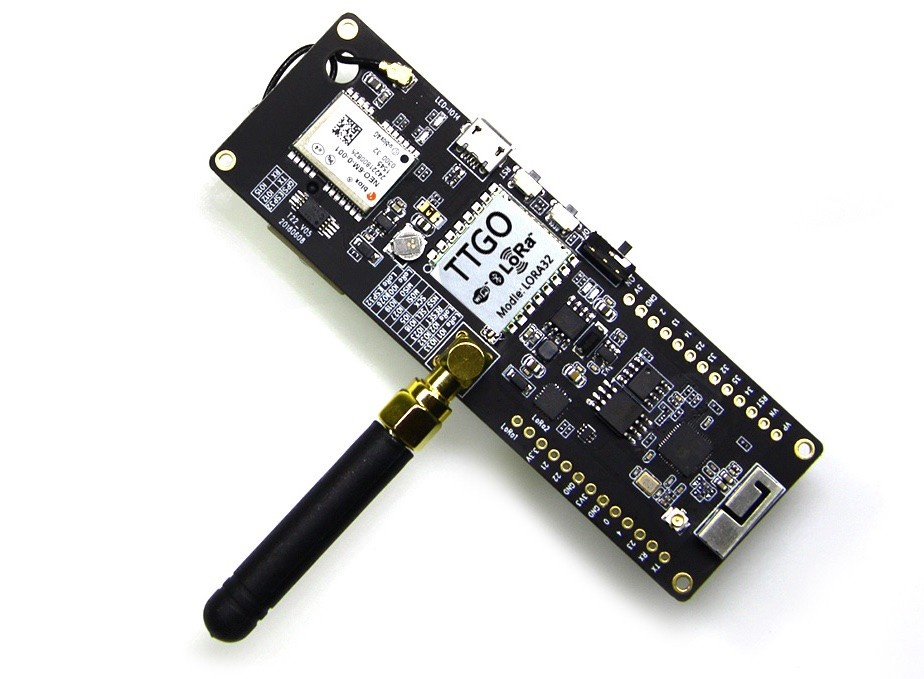
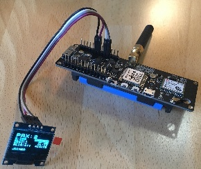

Wemos TTGO T-Beam
=================

Hardware
--------

Micro-controller
^^^^^^^^^^^^^^^^

  
  `TTGO T-Beam <http://tinymicros.com/wiki/TTGO_T-Beam>`_ from Wemos. 
  `TTGO T-Beam pinout <https://github.com/LilyGO/TTGO-T-Beam>`_, example code. 
  
The `Wemos TTGO T-Beam <https://github.com/LilyGO/TTGO-T-Beam>`_ 
is especially suited for mobile operations, because it has an 
on-board battery holder for an 18650 lithium polymer (LiPo) 
battery, a GPS receiver, a LoRa transceiver module (using the 
LoRa chip SX1276) dedicated to the 868 MHz frequency band, and 
an embedded battery charger. The module is operated by the 
`Espressif ESP32 microcontroller <https://www.espressif.com/en/products/hardware/esp32/overview>`_ 
board, which contains a dual-core Xtensa 32bit LX6 processor 
running with up to 240MHz, 4 MB of flash memory (to store the 
program code and some files within a file system), and 520 KB 
of RAM (to store variables, status information, and buffers). 
The ESP32 module also has built-in WiFi and Bluetooth LE 
connectivity. In addition, the TTGO T-Beam has 4 MB of PSRAM 
(pseudo static RAM) that is used as a memory extension for the 
ESP32. The operating voltage of the board is 3.3V (this is 
important when attaching sensors and other peripherals; they 
also must operate on 3.3V). The board offers 18 general purpose 
input/output pins (18 GPIOs), from which up to 12 can be used 
as analog input pins (with 12bit analog digital converters 
(ADC)) and one as analog output pin (8bit digital analog converter 
(DAC)). Some GPIO pins can be used as serial port (programmable 
Universal Asynchronous Receiver and Transmitter, UART), I2C port, 
SPI port, and I2S port. The USB port is connected internally via 
a USB/Serial converter to another serial port (UART). The WiFi 
and Bluetooth antenna are mounted on the TTGO T-Beam board. A 
small GPS antenna is connected via a pigtail to an U.FL / IPX 
connector. The LoRa antenna has to be connected via an SMA-type 
connector. The TTGO T-Beam is available from Chinese sellers 
for around 23 € (I have not found a European shop where it 
can be bought yet).

The LoRa transmitter and receiver is encapsulated within a 
LoRa module. It uses the LoRa chip SX1276 from the company 
Semtech and is dedicated to the 868 MHz frequency band. The 
LoRa module is connected via SPI interface to the microcontroller 
and all of the required connections of the LoRa transceiver 
pins with the microcontroller are already built-in on the TTGO 
T-Beam board. Since the module only implements the LoRa physical 
layer, the LoRaWAN protocol stack must be implemented in software 
on the microcontroller. We are using the Arduino library LMIC 
for that purpose (see below). The implemented LoRaWAN functionality 
is compatible with LoRaWAN Class A/C.

  
  The Wemos TTGO T-Beam with a 2200 mAh 18650 lithium polymer 
  (LiPo) battery (in the battery holder on the backside of the 
  board) with attached OLED display.

Sensor
^^^^^^

While the GPS module of the TTGO T-Beam is labelled as a uBlox 
NEO-6 module, this does not seem to be true. The module seems 
to be of a Chinese brand instead that is not fully compatible 
with the uBlox NEO-6.

The embedded `uBlox EVA 8M GPS <https://www.u-blox.com/en/product/eva-8m-sip>`_ 
module is a standard precision GNSS receiver with 72 channels 
supporting GPS and GLONASS. The module is capable to report up 
to 18 positions per second (18 Hz). It is connected to the 
microcontroller via I2C bus and supports different power saving 
modes. A detailed explanation of the module is given in the 
`uBlox EVA 8M datasheet <https://www.u-blox.com/sites/default/files/EVA-8M_DataSheet_%28UBX-16009928%29.pdf>`_.

Display
^^^^^^^

We have attached a 0.96 in monochrome OLED display to the I2C 
bus of the TTGO T-Beam module. The display is using an SD1306 
controller and has a resolution of 64 x 64 pixels.

Software
--------

The section is still to be written.

Services
--------

The section is still to be written.

Code files
----------

.. literalinclude:: Arduino_Sketch_wemos_ttgo/Arduino_Sketch_wemos_ttgo.ino
   :language: arduino
   :linenos:
   :caption: Arduino Sketch for Wemos TTGO T-Beam sensor node
   :name: Arduino_Sketch_wemos_ttgo.ino

.. literalinclude:: TTN_Payload_Decode.js
   :language: Javascript
   :linenos:
   :caption: TTN payload decoder for Wemos TTGO T-Beam sensor node
   :name: TTN_Payload_Decoder_Seeeduino_wemos
 
References
----------

- `Wemos TTGO T-Beam pinout, libraries, examples <https://github.com/LilyGO/TTGO-T-Beam>`_
- `TTGO T-Beam TinyMicros Wiki (links to schematics, GPS datasheet) <http://tinymicros.com/wiki/TTGO_T-Beam>`_
- `TTGO T-Beam – Kompakter Knochen zum Mappen <https://www.bjoerns-techblog.de/2018/10/ttgo-t-beam-kompakter-knochen-zum-mappen/>`_
- `TTNMapper on the TTGO T-Beam <https://github.com/DeuxVis/Lora-TTNMapper-T-Beam>`_
- `TTNMapper on the TTGO T-Beam with Deep Sleep <https://github.com/PiAir/Lora-TTNMapper-T-Beam>`_
- `Wifi & BLE driven passenger flow metering with cheap ESP32 boards <https://github.com/cyberman54/ESP32-Paxcounter>`_